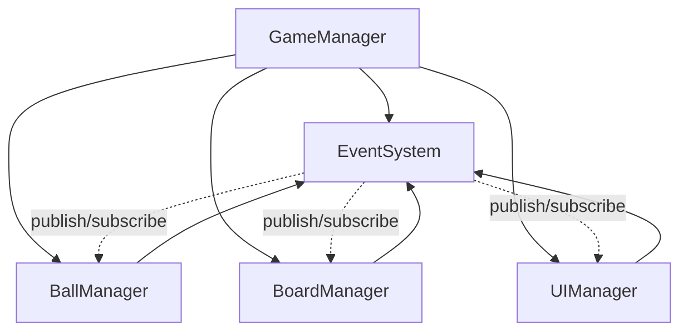

# Pawchinko AI Agent Code & Structure Guide

> Engineering counterpart to `PAWCHINKO_DESIGN_GUIDE.md`. Read this **before** adding or editing any C# code, folder, or asset in Pawchinko. The goal is consistency: every script and folder should look like every other script and folder.

---

## 1. Purpose & how to use this doc

- This is the source of truth for **folder layout, naming, code style, and architecture patterns** in Pawchinko.
- Read it before:
  - Creating a new script.
  - Adding a new folder under `Assets/`.
  - Importing or organising new art assets.
- If a rule here conflicts with what the project actually needs, **update this doc in the same change** as the code. Don't let drift accumulate.
- Every rule below is paired with a copy-paste-shaped C# example. Adapt the names, keep the shape.

---

## 2. Top-level `Assets/` folder layout

```
Assets/
├── Scripts/         all C# code (see §4)
├── VisualAssets/    art only - models, materials, textures, shaders, vfx, fonts, prefabs
├── Scenes/          .unity scene files
├── Settings/        URP / render pipeline / project settings assets
├── Resources/       only when truly needed (Resources.Load is a last resort)
├── Plugins/         third-party DLLs / native plugins
└── Docs~/           AI/human notes, design docs - ignored by Unity
```

Hard rules:

- **Never** put `.cs` files outside `Scripts/`.
- **Never** put art assets outside `VisualAssets/`.
- **Never** create a new top-level folder without a clear category that doesn't fit any of the above.

---

## 3. `.meta` and folder rules

- **Never** edit, rename, or manually delete `.meta` files. Unity owns them. Touching them breaks references in scenes and prefabs.
- Folders ending in `~` (e.g. `Docs~`) **and** folders/files starting with `.` are **completely ignored by Unity**. No `.meta` is generated. Use these for notes, tooling, or scratch content the engine should never touch.
- Don't create new top-level folders without a clear category (see §2).
- When you rename or move a `.cs` file, also move/rename its `.meta` alongside it (most IDEs and Unity itself do this automatically — don't fight them).

---

## 4. `Scripts/` subfolder convention

```
Scripts/
├── Core/         GameManager, EventSystem, Events.cs, custom attributes
├── Data/         [Serializable] data classes - no MonoBehaviour, no logic
├── Managers/     MonoBehaviour managers, one domain each (BallManager, BoardManager, ...)
├── UI/           UI controllers + UIManager that owns UI sub-managers
└── Gameplay/     component scripts that live on prefabs (Ball, Peg, Bumper, ...)
```

Rules:

- One public type per file. File name **must** match the type name (`BallManager.cs` -> `class BallManager`).
- Don't invent new top-level script folders without justification — extend an existing one first.
- If a folder grows past ~10 files, split into feature sub-folders (e.g. `Gameplay/Ball/`, `Gameplay/Board/`).

---

## 5. Namespace & file rules

- Root namespace: `Pawchinko`.
- Sub-namespaces are **optional** and should mirror the folder name when used: `Pawchinko.UI`, `Pawchinko.Data`.
- One public type per file, file name == type name.
- `using` directives go at the **top of the file, outside** the namespace block.

```csharp
using UnityEngine;

namespace Pawchinko
{
    public class BallManager : MonoBehaviour { }
}
```

---

## 6. C# code style

- **Indent**: 4 spaces. No tabs.
- **Braces**: Allman style — opening brace on its own line.
- **Field naming**:
  - `_camelCase` for purely runtime private fields (not exposed to Inspector).
  - `camelCase` (no underscore) for `[SerializeField] private` fields shown in Inspector.
- **Public properties**: `PascalCase`, expression-bodied when trivial.
- **Group serialized fields** with `[Header("...")]` (e.g. `Managers`, `References`, `Settings`, `Prefabs`).
- **Doc comments**: XML `<summary>` on every public class and public method.
- **Logging**: prefix every log with `[ClassName]`. Use `Debug.LogError` for missing Inspector references.
- **Disable logs in non-Editor builds** — keeps the Editor noisy and shipped builds quiet.

```csharp
// Field naming
[SerializeField] private GameObject ballPrefab;       // Inspector field
private readonly List<Ball> _activeBalls = new();     // runtime-only

// Property
public GameObject BallPrefab => ballPrefab;

// Header grouping
[Header("References")]
[SerializeField] private EventSystem eventSystem;

[Header("Settings")]
[SerializeField] private float launchForce = 10f;

// Doc comment
/// <summary>
/// Launches a ball with the configured force.
/// </summary>
public void Launch() { /* ... */ }

// Logging
Debug.Log($"[BallManager] Spawned ball at {position}");
Debug.LogError("[BallManager] ballPrefab not assigned in Inspector!");

// Build-time log gate (place in GameManager.Awake)
#if !UNITY_EDITOR
    Debug.unityLogger.logEnabled = false;
#endif
```

---

## 7. Manager pattern

Every manager follows the same five rules:

1. `MonoBehaviour`, **single responsibility** (one domain only).
2. Exposes `public void Initialize(EventSystem eventSystem)` — called by `GameManager`. **Never** do cross-manager wiring in `Awake` / `Start`.
3. Subscribes to events inside `Initialize`.
4. `OnDestroy` unsubscribes from **every** event it subscribed to.
5. State lives in `[SerializeField] private` fields so it's visible in the Inspector during play (great for debugging).

Additional rules:

- `GameManager` owns sub-managers and exposes them via read-only properties.
- **No service locator**. **No `FindObjectOfType` in hot paths**.
- Singleton pattern is reserved for `GameManager` and `EventSystem` only. Other managers are **not** singletons — access them via `GameManager.Instance.XManager`.

```csharp
// Standard manager skeleton
using UnityEngine;

namespace Pawchinko
{
    /// <summary>
    /// Owns ball spawning and lifecycle.
    /// </summary>
    public class BallManager : MonoBehaviour
    {
        [Header("References")]
        [SerializeField] private EventSystem eventSystem;

        [Header("Prefabs")]
        [SerializeField] private GameObject ballPrefab;

        public void Initialize(EventSystem eventSystem)
        {
            this.eventSystem = eventSystem;
            this.eventSystem.Subscribe<BallLaunchedEvent>(OnBallLaunched);
            Debug.Log("[BallManager] Initialized");
        }

        private void OnBallLaunched(BallLaunchedEvent evt)
        {
            // react to event
        }

        private void OnDestroy()
        {
            if (eventSystem != null)
            {
                eventSystem.Unsubscribe<BallLaunchedEvent>(OnBallLaunched);
            }
        }
    }
}
```

```csharp
// GameManager singleton + manager wiring
using UnityEngine;

namespace Pawchinko
{
    public class GameManager : MonoBehaviour
    {
        private static GameManager _instance;
        public static GameManager Instance => _instance;

        [Header("Managers")]
        [SerializeField] private BallManager ballManager;
        [SerializeField] private BoardManager boardManager;
        [SerializeField] private UIManager uiManager;

        [Header("Event System")]
        [SerializeField] private EventSystem eventSystem;

        public BallManager BallManager => ballManager;
        public BoardManager BoardManager => boardManager;
        public UIManager UIManager => uiManager;
        public EventSystem EventSystem => eventSystem;

        private void Awake()
        {
            if (_instance != null && _instance != this) { Destroy(gameObject); return; }
            _instance = this;
            DontDestroyOnLoad(gameObject);

#if !UNITY_EDITOR
            Debug.unityLogger.logEnabled = false;
#endif

            if (eventSystem == null) eventSystem = EventSystem.Instance;
            InitializeManagers();
        }

        private void InitializeManagers()
        {
            if (ballManager  != null) ballManager.Initialize(eventSystem);
            else Debug.LogError("[GameManager] BallManager not assigned in Inspector!");

            if (boardManager != null) boardManager.Initialize(eventSystem);
            else Debug.LogError("[GameManager] BoardManager not assigned in Inspector!");

            if (uiManager    != null) uiManager.Initialize(eventSystem);
            else Debug.LogError("[GameManager] UIManager not assigned in Inspector!");

            Debug.Log("[GameManager] All managers initialized");
        }
    }
}
```

---

## 8. Event-driven communication

- Managers **never** call each other directly. Communication goes through `EventSystem`.
- Define new event classes in `Scripts/Core/Events.cs`. Plain class, public auto-properties, constructor sets fields.
- Event names end in `Event`. Use **past tense** for "something happened" (`BallLaunchedEvent`, `ScoreChangedEvent`, `RoundEndedEvent`).
- Always `Subscribe` in `Initialize` and `Unsubscribe` in `OnDestroy` — leaks here cause callbacks on destroyed objects.

```csharp
// EventSystem (singleton, generic pub/sub)
using System;
using System.Collections.Generic;
using UnityEngine;

namespace Pawchinko
{
    public class EventSystem : MonoBehaviour
    {
        private static EventSystem _instance;
        public static EventSystem Instance
        {
            get
            {
                if (_instance == null)
                {
                    var go = new GameObject("EventSystem");
                    _instance = go.AddComponent<EventSystem>();
                    DontDestroyOnLoad(go);
                }
                return _instance;
            }
        }

        private readonly Dictionary<Type, List<object>> _listeners = new();

        public void Subscribe<T>(Action<T> cb) where T : class
        {
            var t = typeof(T);
            if (!_listeners.ContainsKey(t)) _listeners[t] = new List<object>();
            _listeners[t].Add(cb);
        }

        public void Unsubscribe<T>(Action<T> cb) where T : class
        {
            if (_listeners.TryGetValue(typeof(T), out var list)) list.Remove(cb);
        }

        public void Publish<T>(T evt) where T : class
        {
            if (!_listeners.TryGetValue(typeof(T), out var list)) return;
            foreach (var l in list) (l as Action<T>)?.Invoke(evt);
        }
    }
}
```

```csharp
// Event class shape (Scripts/Core/Events.cs)
namespace Pawchinko
{
    public class BallLaunchedEvent
    {
        public int BallId { get; set; }
        public float Force { get; set; }
        public BallLaunchedEvent(int id, float force) { BallId = id; Force = force; }
    }
}
```

```csharp
// Publishing
eventSystem.Publish(new BallLaunchedEvent(ballId, 12.5f));
```

---

## 9. Data classes

- Plain C# under `Scripts/Data/`.
- Marked `[Serializable]` and `[UnityEngine.Scripting.Preserve]` so IL2CPP / WebGL stripping doesn't drop them.
- **No methods** beyond simple constructors / helpers.
- **No Unity API usage** (no `MonoBehaviour`, no `Transform`, no `Vector3` if avoidable for serialised payloads).
- Public fields, lowerCamelCase.
- Used as DTOs, saved state, or ScriptableObject payloads.

```csharp
using System;
using UnityEngine;

namespace Pawchinko
{
    [UnityEngine.Scripting.Preserve]
    [Serializable]
    public class BallData
    {
        public int id;
        public string colorName;
        public float radius;
        public int scoreValue;
    }
}
```

---

## 10. UI conventions

- All UI scripts live under `Scripts/UI/`.
- A single `UIManager` owns UI sub-managers (HUD, menus, popups, etc.) and is initialized by `GameManager` like any other manager.
- UI scripts **never** contain game/business logic — they read state via events or manager getters.

```csharp
using UnityEngine;

namespace Pawchinko
{
    /// <summary>
    /// Owns all UI sub-managers (HUD, menus, popups).
    /// </summary>
    public class UIManager : MonoBehaviour
    {
        [Header("UI Sub-Managers")]
        [SerializeField] private HudManager hudManager;

        [Header("References")]
        [SerializeField] private EventSystem eventSystem;

        public HudManager HudManager => hudManager;

        public void Initialize(EventSystem eventSystem)
        {
            this.eventSystem = eventSystem;
            if (hudManager != null) hudManager.Initialize(eventSystem);
            else Debug.LogError("[UIManager] HudManager not assigned in Inspector!");
        }
    }
}
```

---

## 11. VisualAssets conventions

```
VisualAssets/
├── Models/
│   ├── Ball/
│   ├── Board/
│   └── Environment/
├── Materials/
│   ├── Marble/
│   └── Plastic/
├── Textures/
│   ├── Ball/
│   └── Board/
├── Shaders/
├── VFX/
├── Fonts/
└── Prefabs/
```

Rules:

- Categories live under `VisualAssets/`. New categories require a new top-level folder under `VisualAssets/` (don't dump into a wrong category).
- **Sub-folder by family / feature, not by file type**. `Materials/Marble/`, not `Materials/PNG/`.
- Filenames `PascalCase`. Optional type suffixes (`_Mat`, `_Tex`, `_Mesh`) — be consistent within a folder.

---

## 12. Pawchinko-specific scope notes

- Pawchinko is a **single-player physics game**. Don't add network, multiplayer, party, or combat managers unless an actual feature needs them.
- Keep the `GameManager` + `EventSystem` core even when the project is small — they scale cheaply and avoid future refactors.
- **Prefer collapsing related behaviour into one component** until complexity demands a split. Don't pre-emptively shard a single behaviour into three classes.

---

## 13. Architecture overview



`GameManager` initializes every sub-manager with a shared `EventSystem`. Sub-managers communicate **only** through the `EventSystem` — never via direct references to each other.

---

## 14. Checklist for adding a new script (AI quick reference)

- [ ] Correct subfolder under `Scripts/`?
- [ ] In `Pawchinko` namespace?
- [ ] If manager: has `Initialize(EventSystem)`, subscribes in `Initialize`, unsubscribes in `OnDestroy`, registered in `GameManager`?
- [ ] If data: `[Serializable]` + `[UnityEngine.Scripting.Preserve]`, no Unity calls?
- [ ] If event: added to `Core/Events.cs`, name ends in `Event`?
- [ ] `[Header]` groups on serialized fields?
- [ ] `_camelCase` for runtime fields, `camelCase` for `[SerializeField]` fields?
- [ ] `Debug.Log("[ClassName] ...")` prefix?
- [ ] No direct manager-to-manager calls (use events)?
- [ ] No `.meta` files manually created/edited?
