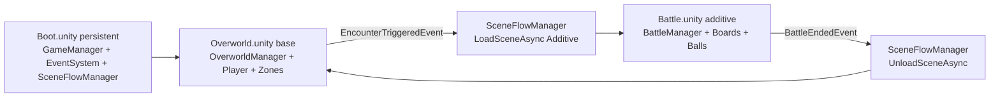
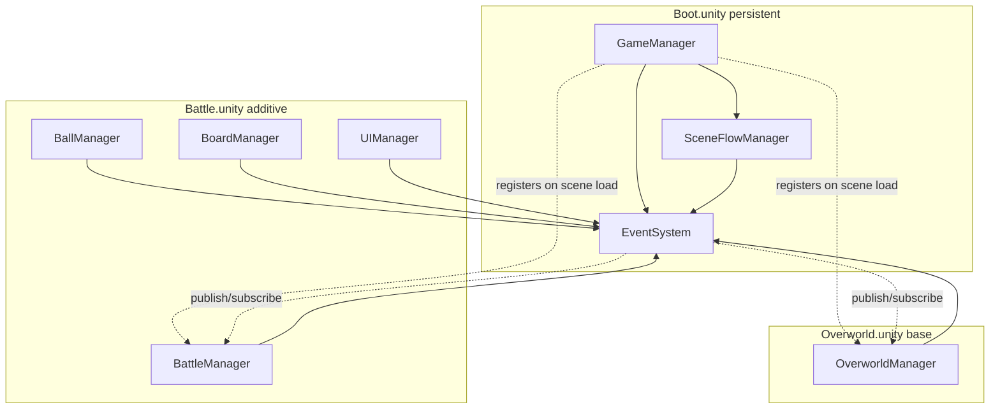

# Pawchinko AI Agent Code & Structure Guide

> Engineering counterpart to `PAWCHINKO_DESIGN_GUIDE.md`. Read this **before** adding or editing any C# code, folder, or asset in Pawchinko. The goal is consistency: every script and folder should look like every other script and folder.

---

## 1. Purpose & how to use this doc

- This is the source of truth for **folder layout, naming, code style, and architecture patterns** in Pawchinko.
- Read it before:
  - Creating a new script.
  - Adding a new folder under `Assets/`.
  - Importing or organising new art assets.
- If a rule here conflicts with what the project actually needs, **update this doc in the same change** as the code. Don't let drift accumulate.
- Every rule below is paired with a copy-paste-shaped C# example. Adapt the names, keep the shape.

---

## 2. Top-level `Assets/` folder layout

```
Assets/
├── Scripts/         all C# code (see §4)
├── VisualAssets/    art only - models, materials, textures, shaders, vfx, fonts, prefabs
├── Scenes/          .unity scene files (see scene model below)
├── Settings/        URP / render pipeline / project settings assets
├── Resources/       only when truly needed (Resources.Load is a last resort)
├── Plugins/         third-party DLLs / native plugins
└── Docs~/           AI/human notes, design docs - ignored by Unity
```

`Scenes/` follows the three-scene model (see §8 for the full architecture):

```
Scenes/
├── Boot.unity        boot scene - GameManager + EventSystem only, persists
├── Overworld.unity   top-down world, player, encounter zones - stays loaded after boot
└── Battle.unity      additively loaded on encounter, additively unloaded on battle end
```

Hard rules:

- **Never** put `.cs` files outside `Scripts/`.
- **Never** put art assets outside `VisualAssets/`.
- **Never** create a new top-level folder without a clear category that doesn't fit any of the above.

---

## 3. `.meta` and folder rules

- **Never** edit, rename, or manually delete `.meta` files. Unity owns them. Touching them breaks references in scenes and prefabs.
- Folders ending in `~` (e.g. `Docs~`) **and** folders/files starting with `.` are **completely ignored by Unity**. No `.meta` is generated. Use these for notes, tooling, or scratch content the engine should never touch.
- Don't create new top-level folders without a clear category (see §2).
- When you rename or move a `.cs` file, also move/rename its `.meta` alongside it (most IDEs and Unity itself do this automatically — don't fight them).

---

## 4. `Scripts/` subfolder convention

```
Scripts/
├── Core/         GameManager, EventSystem, Events.cs, custom attributes
├── Data/         [Serializable] data classes - no MonoBehaviour, no logic
├── Managers/     MonoBehaviour managers, one domain each (SceneFlowManager, OverworldManager, BattleManager, BallManager, BoardManager, ...)
├── UI/           UI controllers + UIManager that owns UI sub-managers
└── Gameplay/     component scripts that live on prefabs - split by scene (see below)
    ├── Overworld/    PlayerController, EncounterZone, OverworldNpc, ...
    └── Battle/       Ball, Peg, Slot, BallSpawner, Bumper, ...
```

Rules:

- One public type per file. File name **must** match the type name (`BallManager.cs` -> `class BallManager`).
- Don't invent new top-level script folders without justification — extend an existing one first.
- **`Gameplay/Overworld/` and `Gameplay/Battle/` must not reference each other directly.** If you find yourself wanting to add a `using` from one to the other, the right answer is an event in `Core/Events.cs` (see §8).
- If a folder grows past ~10 files, split into feature sub-folders (e.g. `Gameplay/Battle/Ball/`, `Gameplay/Battle/Board/`).

---

## 5. Namespace & file rules

- Root namespace: `Pawchinko`.
- Sub-namespaces are **optional** and should mirror the folder name when used: `Pawchinko.UI`, `Pawchinko.Data`.
- One public type per file, file name == type name.
- `using` directives go at the **top of the file, outside** the namespace block.

```csharp
using UnityEngine;

namespace Pawchinko
{
    public class BallManager : MonoBehaviour { }
}
```

---

## 6. C# code style

- **Indent**: 4 spaces. No tabs.
- **Braces**: Allman style — opening brace on its own line.
- **Field naming**:
  - `_camelCase` for purely runtime private fields (not exposed to Inspector).
  - `camelCase` (no underscore) for `[SerializeField] private` fields shown in Inspector.
- **Public properties**: `PascalCase`, expression-bodied when trivial.
- **Group serialized fields** with `[Header("...")]` (e.g. `Managers`, `References`, `Settings`, `Prefabs`).
- **Doc comments**: XML `<summary>` on every public class and public method.
- **Logging**: prefix every log with `[ClassName]`. Use `Debug.LogError` for missing Inspector references.
- **Disable logs in non-Editor builds** — keeps the Editor noisy and shipped builds quiet.

```csharp
// Field naming
[SerializeField] private GameObject ballPrefab;       // Inspector field
private readonly List<Ball> _activeBalls = new();     // runtime-only

// Property
public GameObject BallPrefab => ballPrefab;

// Header grouping
[Header("References")]
[SerializeField] private EventSystem eventSystem;

[Header("Settings")]
[SerializeField] private float launchForce = 10f;

// Doc comment
/// <summary>
/// Launches a ball with the configured force.
/// </summary>
public void Launch() { /* ... */ }

// Logging
Debug.Log($"[BallManager] Spawned ball at {position}");
Debug.LogError("[BallManager] ballPrefab not assigned in Inspector!");

// Build-time log gate (place in GameManager.Awake)
#if !UNITY_EDITOR
    Debug.unityLogger.logEnabled = false;
#endif
```

### Keep it lean

Default to the smallest, most direct implementation that solves the actual problem in front of you. The codebase is small and there are no shipped users yet, so optimise for "easy to read and easy to change next week", not for hypothetical future flexibility.

- **No premature abstraction.** Don't add interfaces, base classes, or generic wrappers until there are at least two real callers that need the seam. One concrete class is fine.
- **No backwards-compat shims for code we wrote yesterday.** When you rename, move, or delete something, update every call site and delete the old name. Don't leave `[Obsolete]` aliases, "legacy" overloads, or wrapper methods that just forward to the new name. Pre-1.0, breaking the API is free.
- **No messy indirection.** If a method just calls another method, inline it. If a manager just forwards an event, let the original publisher own it. Every layer of indirection has to earn its keep.
- **No dead code, no commented-out code, no "just in case" parameters.** Delete it. Git remembers.
- **Prefer fewer files.** A 60-line helper class that's used in one place belongs as a `private static` method, not a new file in `Core/`.

**Pragmatic exception** — for *small, isolated* changes (a one-line fix, a tweak to a single field, an additive new method), it is fine to deviate from these rules if doing it "properly" would force a risky refactor that's out of scope for the change. In that case, leave a short `// TODO:` (or call it out in `DEV_LOG.md`) so the next agent knows the cleanup is owed. The rule is: *don't make the codebase worse to make a small change easier, but don't blow up the change scope to chase perfect either.*

---

## 7. Manager pattern

Every manager follows the same five rules:

1. `MonoBehaviour`, **single responsibility** (one domain only).
2. Exposes `public void Initialize(EventSystem eventSystem)` — called by `GameManager`. **Never** do cross-manager wiring in `Awake` / `Start`.
3. Subscribes to events inside `Initialize`.
4. `OnDestroy` unsubscribes from **every** event it subscribed to.
5. State lives in `[SerializeField] private` fields so it's visible in the Inspector during play (great for debugging).

Additional rules:

- `GameManager` owns sub-managers and exposes them via read-only properties.
- **No service locator**. **No `FindObjectOfType` in hot paths**.
- Singleton pattern is reserved for `GameManager` and `EventSystem` only. Other managers are **not** singletons — access them via `GameManager.Instance.XManager`.

```csharp
// Standard manager skeleton
using UnityEngine;

namespace Pawchinko
{
    /// <summary>
    /// Owns ball spawning and lifecycle.
    /// </summary>
    public class BallManager : MonoBehaviour
    {
        [Header("References")]
        [SerializeField] private EventSystem eventSystem;

        [Header("Prefabs")]
        [SerializeField] private GameObject ballPrefab;

        public void Initialize(EventSystem eventSystem)
        {
            this.eventSystem = eventSystem;
            this.eventSystem.Subscribe<BallLaunchedEvent>(OnBallLaunched);
            Debug.Log("[BallManager] Initialized");
        }

        private void OnBallLaunched(BallLaunchedEvent evt)
        {
            // react to event
        }

        private void OnDestroy()
        {
            if (eventSystem != null)
            {
                eventSystem.Unsubscribe<BallLaunchedEvent>(OnBallLaunched);
            }
        }
    }
}
```

```csharp
// GameManager singleton + manager wiring
using UnityEngine;

namespace Pawchinko
{
    public class GameManager : MonoBehaviour
    {
        private static GameManager _instance;
        public static GameManager Instance => _instance;

        [Header("Managers")]
        [SerializeField] private BallManager ballManager;
        [SerializeField] private BoardManager boardManager;
        [SerializeField] private UIManager uiManager;

        [Header("Event System")]
        [SerializeField] private EventSystem eventSystem;

        public BallManager BallManager => ballManager;
        public BoardManager BoardManager => boardManager;
        public UIManager UIManager => uiManager;
        public EventSystem EventSystem => eventSystem;

        private void Awake()
        {
            if (_instance != null && _instance != this) { Destroy(gameObject); return; }
            _instance = this;
            DontDestroyOnLoad(gameObject);

#if !UNITY_EDITOR
            Debug.unityLogger.logEnabled = false;
#endif

            if (eventSystem == null) eventSystem = EventSystem.Instance;
            InitializeManagers();
        }

        private void InitializeManagers()
        {
            if (ballManager  != null) ballManager.Initialize(eventSystem);
            else Debug.LogError("[GameManager] BallManager not assigned in Inspector!");

            if (boardManager != null) boardManager.Initialize(eventSystem);
            else Debug.LogError("[GameManager] BoardManager not assigned in Inspector!");

            if (uiManager    != null) uiManager.Initialize(eventSystem);
            else Debug.LogError("[GameManager] UIManager not assigned in Inspector!");

            Debug.Log("[GameManager] All managers initialized");
        }
    }
}
```

> The example above shows the simple case where every manager lives in the same scene as `GameManager`. In Pawchinko, `GameManager` lives in `Boot.unity` and only the always-present managers (e.g. `SceneFlowManager`) are wired in the Inspector at boot. **Scene-scoped managers like `OverworldManager` and `BattleManager` register themselves with `GameManager` when their scene loads** and call `Initialize(eventSystem)` from there. See §8 for the full lifecycle.

---

## 8. Scene architecture

Pawchinko uses **three Unity scenes**, each with a clear job. Scene boundaries are how we keep the overworld and the battle instance from leaking into each other (see `PAWCHINKO_DESIGN_GUIDE.md` Section 4 for the design intent).

### The three scenes

```
Boot.unity         persistent      GameManager + EventSystem + SceneFlowManager (DontDestroyOnLoad)
Overworld.unity    base scene      OverworldManager + player + encounter zones + world NPCs
Battle.unity       additive scene  BattleManager + boards + balls + battle UI + battle camera
```

- **Boot** is loaded first. It instantiates `GameManager`, `EventSystem`, and `SceneFlowManager`, marks them `DontDestroyOnLoad`, then asks `SceneFlowManager` to load `Overworld.unity` as the active scene.
- **Overworld** is loaded after boot and **stays loaded for the rest of the session**. It is never unloaded by gameplay code.
- **Battle** is loaded **additively on top** of `Overworld` when an encounter triggers, and **additively unloaded** when the battle ends. The overworld remains in memory the whole time so the player returns to the exact spot they left.

### `SceneFlowManager`

`SceneFlowManager` is the **only** script in the project allowed to call `SceneManager.LoadSceneAsync` / `UnloadSceneAsync`. Everything else asks it to change scenes by publishing an event.

```csharp
using UnityEngine;
using UnityEngine.SceneManagement;

namespace Pawchinko
{
    /// <summary>
    /// Sole owner of scene loading / unloading.
    /// Listens for EncounterTriggeredEvent and BattleEndedEvent.
    /// </summary>
    public class SceneFlowManager : MonoBehaviour
    {
        [Header("Scene Names")]
        [SerializeField] private string overworldSceneName = "Overworld";
        [SerializeField] private string battleSceneName = "Battle";

        [Header("References")]
        [SerializeField] private EventSystem eventSystem;

        public void Initialize(EventSystem eventSystem)
        {
            this.eventSystem = eventSystem;
            this.eventSystem.Subscribe<EncounterTriggeredEvent>(OnEncounterTriggered);
            this.eventSystem.Subscribe<BattleEndedEvent>(OnBattleEnded);
        }

        private void OnEncounterTriggered(EncounterTriggeredEvent evt)
        {
            eventSystem.Publish(new OverworldPausedEvent());
            SceneManager.LoadSceneAsync(battleSceneName, LoadSceneMode.Additive);
        }

        private void OnBattleEnded(BattleEndedEvent evt)
        {
            var op = SceneManager.UnloadSceneAsync(battleSceneName);
            if (op != null) op.completed += _ => eventSystem.Publish(new OverworldResumedEvent());
        }

        private void OnDestroy()
        {
            if (eventSystem == null) return;
            eventSystem.Unsubscribe<EncounterTriggeredEvent>(OnEncounterTriggered);
            eventSystem.Unsubscribe<BattleEndedEvent>(OnBattleEnded);
        }
    }
}
```

### Scene-scoped managers

Each gameplay scene has a scene root that owns the systems for that scene:

- `OverworldManager` (in `Overworld.unity`) - owns the player controller, encounter zones, overworld camera, world NPCs.
- `BattleSceneRoot` (in `Battle.unity`) - owns battle manager initialization order: board, ball, scoring, energy, battle, UI.
- `BattleManager` remains the battle state machine; it does not own every battle subsystem directly.

Lifecycle:

1. When a scene loads, its scene root `Awake`s.
2. It registers itself with `GameManager` (`RegisterOverworldManager` or `RegisterBattleScene`).
3. `GameManager` passes the shared `eventSystem` to the root. `BattleSceneRoot` then initializes battle sub-managers in the required order.
4. When the scene unloads, the scene root and sub-managers unsubscribe from events and deregister from `GameManager`.

`GameManager` exposes scene-scoped managers as **nullable** properties (`BattleManager` is `null` until a battle is loaded). Code that touches them must null-check.

### Pause semantics

When `Battle` is additively loaded, the overworld must not tick:

- `OverworldManager` subscribes to `OverworldPausedEvent` and `OverworldResumedEvent`. On pause: disable input, halt NPC AI ticks, freeze the player controller. On resume: re-enable.
- The overworld camera is disabled while battle is loaded (the battle scene has its own camera).
- Overworld physics objects can stay live - they just shouldn't be receiving input or AI commands.

### Cross-scene communication rules (non-negotiable)

- **Battle and Overworld code may never hold direct references to each other.** No `using Pawchinko.Overworld` from a `Battle/` script, ever.
- **All cross-scene comms go through `EventSystem`.** This is just the existing project rule (§9), restated because it's especially load-bearing here.
- The minimum new event surface for the scene flow:
  - `EncounterTriggeredEvent` - published by an `EncounterZone` (overworld). Payload TBD.
  - `OverworldPausedEvent` / `OverworldResumedEvent` - published by `SceneFlowManager`.
  - `BattleStartedEvent` - published by `BattleManager` once it's wired up.
  - `BattleEndedEvent` - published by `BattleManager` when the battle resolves. Payload TBD (winner, rewards).
- *(TBD: payload format for `EncounterTriggeredEvent` - which trainer or wild Paw, return-to coordinates, etc. Don't invent these; flag to the user when implementation needs them.)*

### Scene architecture diagram



### Hard rules

- **Never** call `SceneManager.LoadSceneAsync` / `UnloadSceneAsync` from anywhere other than `SceneFlowManager`.
- **Never** put battle prefabs (Ball, Peg, Slot, BallSpawner, board meshes) in the `Overworld` scene, and never put overworld prefabs (player, encounter zones, world NPCs) in the `Battle` scene.
- **Never** persist battle-only runtime state into a singleton or `DontDestroyOnLoad` object that survives `BattleEndedEvent`. Battle state dies with the battle scene.
- **Never** trigger a new encounter while `Battle` is loaded - `EncounterZone` must check the current scene state (or guard via `OverworldPausedEvent`) before publishing.

---

## 9. Event-driven communication

- Managers **never** call each other directly. Communication goes through `EventSystem`.
- Define new event classes in `Scripts/Core/Events.cs`. Plain class, public auto-properties, constructor sets fields.
- Event names end in `Event`. Use **past tense** for "something happened" (`BallLaunchedEvent`, `ScoreChangedEvent`, `RoundEndedEvent`).
- Always `Subscribe` in `Initialize` and `Unsubscribe` in `OnDestroy` — leaks here cause callbacks on destroyed objects.

```csharp
// EventSystem (singleton, generic pub/sub)
using System;
using System.Collections.Generic;
using UnityEngine;

namespace Pawchinko
{
    public class EventSystem : MonoBehaviour
    {
        private static EventSystem _instance;
        public static EventSystem Instance
        {
            get
            {
                if (_instance == null)
                {
                    var go = new GameObject("EventSystem");
                    _instance = go.AddComponent<EventSystem>();
                    DontDestroyOnLoad(go);
                }
                return _instance;
            }
        }

        private readonly Dictionary<Type, List<object>> _listeners = new();

        public void Subscribe<T>(Action<T> cb) where T : class
        {
            var t = typeof(T);
            if (!_listeners.ContainsKey(t)) _listeners[t] = new List<object>();
            _listeners[t].Add(cb);
        }

        public void Unsubscribe<T>(Action<T> cb) where T : class
        {
            if (_listeners.TryGetValue(typeof(T), out var list)) list.Remove(cb);
        }

        public void Publish<T>(T evt) where T : class
        {
            if (!_listeners.TryGetValue(typeof(T), out var list)) return;
            foreach (var l in list) (l as Action<T>)?.Invoke(evt);
        }
    }
}
```

```csharp
// Event class shape (Scripts/Core/Events.cs)
namespace Pawchinko
{
    public class BallLaunchedEvent
    {
        public int BallId { get; set; }
        public float Force { get; set; }
        public BallLaunchedEvent(int id, float force) { BallId = id; Force = force; }
    }
}
```

```csharp
// Publishing
eventSystem.Publish(new BallLaunchedEvent(ballId, 12.5f));
```

### When NOT to use the bus

**UI never publishes to the bus.** Button clicks, slider drags, and other local UI inputs should call the relevant manager directly (e.g. `GameManager.Instance.BattleManager.StartBattle()`) — Unity's built-in `Button.onClick` `UnityEvent` already handles the UI side. The custom `EventSystem` is reserved for **cross-system gameplay broadcasts** that announce something happened in the game world (round started, drop requested, ball settled, battle ended).

The flow is always: **UI → manager method → (manager publishes gameplay event for everyone else).** Managers may publish gameplay events even when no other system listens yet, as long as it represents a real game-state moment (`BattleStartedEvent`, `DropRequestedEvent`) — that's cheap and lets future systems (SFX, camera, analytics) subscribe without touching the publisher.

What this rules out: **don't republish a UI click as an event** just because UI code happens to be reacting to a button press.

```csharp
// BAD - UI publishing its own click onto the bus
private void OnStartClicked()
{
    eventSystem.Publish(new StartButtonClickedEvent()); // UI input, not a gameplay broadcast
}

// GOOD - UI calls the manager directly; the manager publishes the gameplay event
private void OnStartClicked()
{
    GameManager.Instance.BattleManager.StartBattle();
}

public void StartBattle()
{
    // ... state transitions ...
    eventSystem.Publish(new BattleStartedEvent());      // gameplay broadcast - EnergyManager seeds, HUD reacts, ...
    eventSystem.Publish(new RoundStartedEvent(...));
}
```

---

## 10. Data classes

- Plain C# under `Scripts/Data/`.
- Marked `[Serializable]` and `[UnityEngine.Scripting.Preserve]` so IL2CPP / WebGL stripping doesn't drop them.
- **No methods** beyond simple constructors / helpers.
- **No Unity API usage** (no `MonoBehaviour`, no `Transform`, no `Vector3` if avoidable for serialised payloads).
- Public fields, lowerCamelCase.
- Used as DTOs, saved state, or ScriptableObject payloads.

```csharp
using System;
using UnityEngine;

namespace Pawchinko
{
    [UnityEngine.Scripting.Preserve]
    [Serializable]
    public class BallData
    {
        public int id;
        public string colorName;
        public float radius;
        public int scoreValue;
    }
}
```

---

## 11. UI conventions

- All UI scripts live under `Scripts/UI/`.
- A single `UIManager` owns UI sub-managers (HUD, menus, popups, etc.) and is initialized by `GameManager` like any other manager.
- UI scripts **never** contain game/business logic — they read state via events or manager getters.

```csharp
using UnityEngine;

namespace Pawchinko
{
    /// <summary>
    /// Owns all UI sub-managers (HUD, menus, popups).
    /// </summary>
    public class UIManager : MonoBehaviour
    {
        [Header("UI Sub-Managers")]
        [SerializeField] private HudManager hudManager;

        [Header("References")]
        [SerializeField] private EventSystem eventSystem;

        public HudManager HudManager => hudManager;

        public void Initialize(EventSystem eventSystem)
        {
            this.eventSystem = eventSystem;
            if (hudManager != null) hudManager.Initialize(eventSystem);
            else Debug.LogError("[UIManager] HudManager not assigned in Inspector!");
        }
    }
}
```

---

## 12. VisualAssets conventions

```
VisualAssets/
├── Models/
│   ├── Ball/
│   ├── Board/
│   └── Environment/
├── Materials/
│   ├── Marble/
│   └── Plastic/
├── Textures/
│   ├── Ball/
│   └── Board/
├── Shaders/
├── VFX/
├── Fonts/
└── Prefabs/
```

Rules:

- Categories live under `VisualAssets/`. New categories require a new top-level folder under `VisualAssets/` (don't dump into a wrong category).
- **Sub-folder by family / feature, not by file type**. `Materials/Marble/`, not `Materials/PNG/`.
- Filenames `PascalCase`. Optional type suffixes (`_Mat`, `_Tex`, `_Mesh`) — be consistent within a folder.

---

## 13. Pawchinko-specific scope notes

- Pawchinko is a **single-player game with a persistent overworld and an additively-loaded battle instance** (see §8). Don't add network, multiplayer, party, or combat managers unless an actual feature needs them.
- **Don't merge overworld and battle systems into one manager.** They live in separate scenes for a reason - the boundary keeps the physics drop, battle UI, and battle state from leaking into the overworld and vice versa.
- Keep the `GameManager` + `EventSystem` + `SceneFlowManager` core even when the project is small — they scale cheaply and avoid future refactors.
- **Prefer collapsing related behaviour into one component** until complexity demands a split. Don't pre-emptively shard a single behaviour into three classes.

---

## 14. Architecture overview



- `GameManager`, `EventSystem`, and `SceneFlowManager` live in `Boot.unity` and are `DontDestroyOnLoad`.
- `OverworldManager` lives in `Overworld.unity` and registers with `GameManager` on scene load.
- `BattleManager` (and the battle-only sub-managers it owns: `BallManager`, `BoardManager`, the battle `UIManager`) live in `Battle.unity` and only exist while the battle scene is additively loaded.
- All cross-scene comms go through `EventSystem` — never via direct references between overworld and battle code.

---

## 15. Checklist for adding a new script (AI quick reference)

- [ ] Correct subfolder under `Scripts/`?
- [ ] If gameplay: in the right scene's folder (`Gameplay/Overworld/` vs `Gameplay/Battle/`) and free of cross-scene `using` statements?
- [ ] In `Pawchinko` namespace?
- [ ] If manager: has `Initialize(EventSystem)`, subscribes in `Initialize`, unsubscribes in `OnDestroy`, registered in `GameManager`?
- [ ] If data: `[Serializable]` + `[UnityEngine.Scripting.Preserve]`, no Unity calls?
- [ ] If event: added to `Core/Events.cs`, name ends in `Event`?
- [ ] If it triggers a scene change: does it publish to `SceneFlowManager` rather than calling `SceneManager.LoadSceneAsync` directly?
- [ ] If it crosses the overworld/battle boundary: does it use events only (no direct references)?
- [ ] `[Header]` groups on serialized fields?
- [ ] `_camelCase` for runtime fields, `camelCase` for `[SerializeField]` fields?
- [ ] `Debug.Log("[ClassName] ...")` prefix?
- [ ] No direct manager-to-manager calls (use events)?
- [ ] No `.meta` files manually created/edited?
