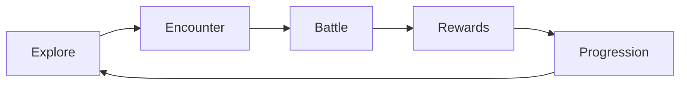
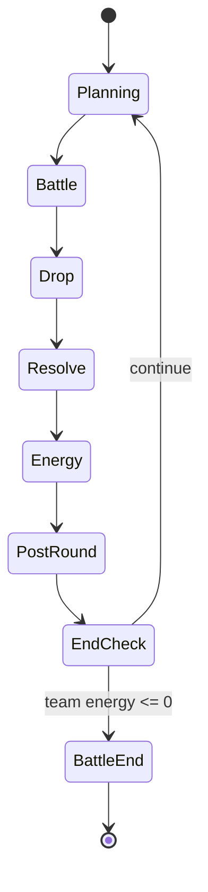
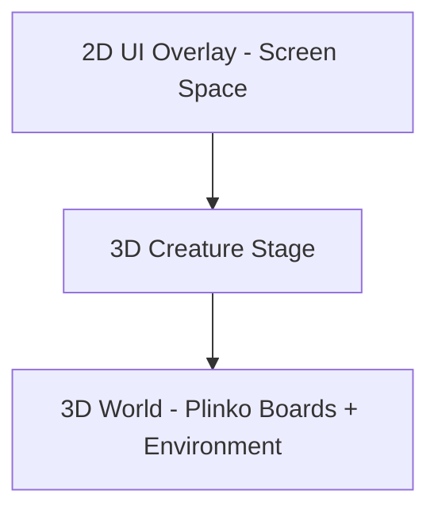
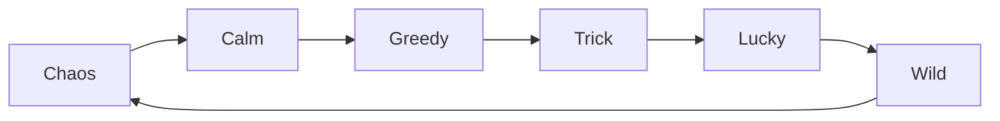

# Pawchinko - Game Design Guide

> Single source of truth for the Pawchinko game vision, gameplay rules, and on-screen layout. Replaces the original `Pawchinko_Full_GDD_Unity.pdf` (which is being deleted). Written for AI coding agents (primary audience) and human designers (secondary audience).

---

## 1. About This Document

> Purpose: define what Pawchinko *is* and how it *plays*, so anyone (AI or human) can build toward the same target.

- **Audience**: AI coding agents first, human designers second. Use plain language, explicit rules, and call out unknowns rather than inventing values.
- **How to use**: read top-to-bottom once. When in doubt during implementation, prefer Sections 2-22 (binding design intent) over Section 23 (suggested architecture).
- **Hard rule**: do not invent mechanics that contradict the **Pinned Design Rules** in Section 20 or the **AI Agent Guardrails** in Section 21.
- **Status of this doc**: living document. Deeper per-system specs (Battle, Board, Ball, Ability, Energy, Creature) will be authored separately later. This guide is the "north star," not the implementation contract.

---

## 2. High Concept

> Elevator pitch for the whole product.

Pawchinko is a hybrid of **creature-collection RPG** and **competitive pachinko battler**. Players explore a top-down world, collect Pom creatures, build teams, and battle other trainers using a physics-driven multi-ball system played on side-by-side plinko boards.

The core innovation is combining **strategy** (team building, queue order, ability choice) with **controlled randomness** (the physics drop on the board).

**Pillar statement**: *"Strategy you choose + controlled randomness you watch."*

**Tone**: cute, vibrant, family-friendly creature collector with competitive depth. Readable at a glance, deep on a second look.

---

## 3. Core Loop

> The macro game flow that every session repeats.

```
Explore -> Encounter -> Battle -> Rewards -> Progression -> Explore
```



- **Explore** - the player walks a 3D top-down overworld (Pokemon-style camera and movement). See Section 4 for the overworld system.
- **Encounter** - stepping into an encounter zone (or interacting with a fixed-encounter NPC) triggers the transition out of the overworld and into a separate **battle instance**. The overworld is paused, not destroyed.
- **Battle** - round-based plinko duel inside the battle instance (see Section 5).
- **Rewards** - EXP and likely currency / items / new-creature unlocks. *(TBD: exact reward contents and rates.)*
- **Progression** - apply EXP, level up creatures, unlock new stats / ball counts / abilities.
- Loop back to Explore - control returns to the overworld at the same spot the player left.

---

## 4. Overworld System

> The Pokemon-style top-down world the player explores between battles. This is a first-class system, not a backdrop for the battle screen.

The overworld is the persistent slice of the game where the player walks around, finds creatures, talks to NPCs, and triggers battles. It is a **separate instance** from the battle - the two never share a scene, never share a camera, and never share input.

### Camera and movement

- **Top-down 3D camera** angled slightly forward, framing the player and a comfortable area around them. Pokemon-style readability: tile-relative motion is fine, full free 3D movement is also fine - the design intent is "walk around a 3D world from above," not a specific control scheme.
- **Player avatar** is a 3D model (matching the chibi creature style from Section 18) with idle and walk animations.
- Movement is **input-agnostic** (see Section 19) - directional input on touch, keyboard, or gamepad.

### Encounter zones

- **Encounter zones** are tagged regions of the overworld (grass patches, caves, water, story trigger volumes, NPC line-of-sight cones, etc.) that can start a 1v1 battle when the player enters or interacts.
- **Encounter sources**:
  - **Wild encounters** - random rolls while moving through a zone. Produces a battle against a wild Pom.
  - **Trainer encounters** - scripted or line-of-sight encounters with rival NPC trainers.
  - **Story encounters** - fixed, plot-driven battles tied to specific overworld triggers.
- Encounter rate, allowed species per zone, and trainer rosters are **design data sets**, authored later. *(TBD: encounter rate formula, per-zone species tables, NPC trainer lineups.)*

### Transition into battle

When an encounter triggers:

1. The overworld **pauses** - input disabled, AI / NPC ticks halted, camera frozen. The overworld scene state is preserved exactly as it was.
2. The **battle instance loads on top** of the overworld. The battle flow (see Section 5) and battle scene composition (see Section 6) describe what the player sees and interacts with for the duration of the battle.
3. The battle resolves to completion (one team's energy hits zero - see Section 7).
4. Rewards are applied (see Section 16).
5. The battle instance **unloads**. The overworld **resumes** at the exact spot the player left, with the player avatar and world state untouched.

### Hard rules

- **Overworld and Battle are two distinct instances.** Battle never happens "inside" the overworld scene. The overworld never instantiates battle systems (boards, balls, battle UI), and the battle never instantiates overworld systems (player controller, encounter zones).
- **One battle at a time.** A new encounter cannot trigger while a battle instance is loaded.
- **Return-to-spot is mandatory.** After battle, the player resumes at the same overworld coordinates and facing direction they had at encounter time. The overworld does not reset.

### TBD

- Encounter rate formula and per-zone tuning.
- NPC trainer behavior in the overworld (patrols, line-of-sight cones, post-battle dialogue).
- Save / restore granularity for the overworld pause (full state snapshot vs. trusting the scene to remain in memory).
- Whether the overworld plays a transition flourish (camera zoom, screen wipe) before the battle scene appears.

---

## 5. Battle Flow

> What happens inside a single battle, broken down per round.

> **Vertical-slice note**: the current implementation runs the data wire-in (flexible 1..N Pom rosters per side, no Planning Phase UI, no AP economy, no ability selection). The phases below describe the target design - matching code is **TBD** and lands in follow-up passes.

Each Pawler enters battle with a **flexible team of 1..N Poms** (per-encounter cap **TBD**). At any moment **up to 3 Poms are active** (on the board, spawning balls, using abilities); any remaining Poms sit on the **bench** (recovering AP, preparing later moves). A Pawler bringing only 1 or 2 Poms is valid - they simply have a smaller active set and no bench. A battle is a sequence of **rounds**, and each round runs through these phases in order:

1. **Planning Phase** - the player can:
   - Select / swap the active Poms (up to 3) from the team.
   - Choose abilities / moves for this round (per-active-Pom ability slot - see Section 13; selection scope still **TBD**).
   - Review the enemy's setup (visible active vs bench, opponent's chosen ability surface - exact visibility rules **TBD**).
   - Prepare strategy for the upcoming Battle Phase. This is the main strategy phase.
2. **Battle Phase** - the player presses **BATTLE** to lock in their plan. All active Poms from both sides spawn balls simultaneously; total balls per side = sum of every active Pom's ball-count contribution. From this moment on it is pure physics + already-locked-in modifiers; the player has no further input until resolution completes.
3. **Drop / Physics Resolution** - balls drop through pegs into buckets, hitting peg modifiers and bucket modifiers from the locked-in abilities.
4. **Scoring** - per-ball scores are tallied and summed into a round score for each side.
5. **Energy Update** - applies the round score difference to both teams' energy pools (see Section 7).
6. **Post-Round** - temporary effects clear, **bench Poms recover AP** (recovery rate **TBD**), then return to the Planning Phase.
7. **End-of-Round Check** - if either team's energy is at or below 0, the battle ends; otherwise advance to the next Planning Phase.



- **Round end trigger**: every dropped ball has settled in a bucket or exited the board.
- **Battle end trigger**: at least one team's summed energy reaches 0 or below.
- **No fixed round limit.** Battles run as many rounds as it takes for one team's energy to hit zero.

### Active vs bench

- **Active Poms** contribute balls, run abilities, and react visually to round events.
- **Bench Poms** sit out this round, recover AP, and can be swapped in during the next Planning Phase.
- Bench rotation is a first-class strategy lever (see Section 15) - strong abilities may require several rounds of saved AP, so deciding who recovers vs who pushes is core to the loop.

---

## 6. Battle Scene Composition (CRITICAL)

> How the battle scene is built in 3D + 2D layers. This is the most-misinterpreted area, so read carefully. This whole section describes the **battle instance only** - the overworld scene (Section 4) has its own composition.

### Layer breakdown



The scene is composed of three logical layers. Top layers render in front of lower layers.

- **3D World Layer (back)**
  - Two **plinko boards** built as 3D meshes, side by side in world space.
  - Player board on the **left**, tinted **blue / cool**. Enemy board on the **right**, tinted **red / warm**.
  - Soft cloud / sky environment behind both boards.
  - **Pegs** are real round plinko pegs arranged in a triangular / staggered grid. Pegs may include "modifier pegs" with visual states.
  - **Buckets** are 3D containers at the base of each board, each with a base value.
  - Balls are 3D physics objects that drop through this layer.

- **3D Creature Stage Layer (middle)**
  - **One 3D model per Pom in the roster, per side**, arranged vertically along the outer edge of each board (left edge for the player team, right edge for the enemy team). With a full bench the strip shows the full team; with a smaller roster the strip is shorter.
  - The **active Poms (up to 3)** are highlighted; any bench Poms read as dimmed / pulled back. *(TBD: whether bench Poms render in the 3D stage at all or only on the 2D roster strip - confirm with design before implementing.)*
  - These are real 3D meshes with idle animation, NOT 2D portraits.
  - They react visually to round events (cheer on bucket hits, flinch on enemy abilities, etc.).

- **2D UI Overlay Layer (front)**
  - Screen Space (Overlay or Camera) UI placed above the 3D scene:
    - Round counter (top center).
    - Player team roster strip (left edge): per-row name + level.
    - Enemy team roster strip (right edge): per-row name + level.
    - Active-creature indicator (small arrow / highlight next to the active row in the roster).
    - Active player creature card (bottom-left): portrait, level, name, ball-count badge, and the locked-in ability with its badge.
    - Active enemy creature card (bottom-right): mirrored.
    - Round score readout (bottom-center, e.g. "87 | 72").
    - **DROP** button (bottom-center, above the score readout).
    - Bucket value labels (overlaid above each 3D bucket).

### Camera

- Framed to show **both boards in full**, both creature stages, and leave headroom + bottom margin for the UI overlay.
- Slight forward tilt so the peg field reads cleanly from above.
- No camera switching during the drop; the whole round resolves in one continuous shot.

### Design Clarifications

A few rules that are easy to get wrong - restated here so they're impossible to miss:

- **Up to 3 active Poms per side per round.** Roster size itself is flexible (1..N total Poms - per-encounter cap **TBD**); whatever is in the roster beyond the active 3 sits on the bench. A Pawler bringing only 1 or 2 Poms is valid - they fight with that smaller active set and have no bench. Active and bench visual treatment is **TBD**, but "no more than 3 active simultaneously" is binding.
- **Pegs are round plinko-style pegs**, not stars, sparkles, or abstract dots. Real plinko geometry only.
- **Energy is team-summed.** Per-creature HP bars are explicitly out of scope - do not add them to the roster strips (see Section 7 and Section 21).
- **Ball art is type-themed per source Pom.** Generic round-ball / "Pokeball" placeholder visuals are not canonical; balls must read as belonging to their source Pom's type.
- **Illustrative values are not canonical.** Any specific Pom names, ability names, faction names, bucket numbers, round numbers, or score numbers shown elsewhere in this guide are illustrative examples only. Only positions, components, and counts are binding.

---

## 7. Energy System

> Energy is the win condition. Health for the team, not the individual.

- Displayed during scoring as `Player | Enemy` (e.g. `87 | 72`, illustrative).
- **Team-based**: starting team energy = sum of every Pom's `Energy Value` stat **across the entire roster** (active + bench) at battle start. Bench Poms still contribute to the starting pool even though they are not on the board. A smaller roster therefore has a smaller starting energy pool.
- **Per-round formula**:
  - `Difference = PlayerScore - EnemyScore`
  - `PlayerEnergy += Difference`
  - `EnemyEnergy -= Difference`
  - (i.e. the round score difference is awarded to the winner and subtracted from the loser.)
- **Battle ends** when either side's energy drops to 0 or below.
- Individual Poms **do not** have their own HP bars and **cannot be KO'd individually**. Swapping a Pom to the bench is a rotation choice, not a knock-out.

---

## 8. Creatures (Poms)

> What a Pom is and what data defines one.

A **Pom** is a collectible creature with identity and progression. The data layer mirrors this shape directly: `PomDefinition` (ScriptableObject) holds the static species data, `Pom` (plain `[Serializable]`) is the runtime instance with mutable level / exp / learned abilities.

Each Pom has the following fields:

- **Type** - one of Chaos / Calm / Greedy / Trick / Lucky / Wild (see Section 10).
- **Level** - integer 1 to 50.
- **Energy Value** - the creature's contribution to the team's starting energy pool.
- **AP Cost** - action-point cost to deploy / queue this creature in a round. *(TBD: full AP economy - per-round AP budget, refresh rules, and how AP relates to which creatures can act.)*
- **Stats** - Power, Weight, Luck, Control (see Section 9).
- **Ball Profile** - the data that describes this creature's balls (`PomBallProfile`):
  - Ball **type** (matches creature type).
  - Ball **spawn pattern** (e.g. scatter, focused).
  - Ball **count scale** - inclusive level bands; each band has its own ball count. The runtime Pom resolves its current ball count from this scale at its current level.
  - Ball **behavior tags** (examples only: bouncy, heavy, splitter, sticky). The exact tag list is a design data set, not fixed here.
- **Abilities** - a **learnable pool** authored on the species (`learnableAbilities` on `PomDefinition`). At runtime each Pom has **at most 2 learned abilities** at a time; learning a third replaces one. **Abilities are type-locked**: a Pom can only learn abilities whose type matches its own (see Section 13).
- **Visual Identity** - main colors + effect tags, authored as designer hints; the actual art binding lives on prefabs.

Two Poms of the same species share the same `PomDefinition` but each carries its own runtime state (level, exp, the two chosen learned abilities). Two Poms of the same type but different species can produce visually-distinct balls of that type with different physical behavior.

### Authoring shape (canonical reference)

`PomDefinition` assets follow this shape (illustrative values - see the `CreateAssetMenu` paths under `Pawchinko/Pom/...` in the Project window):

```json
{
  "id": "POM_001",
  "name": "Glitch Pug",
  "species": "Static Hound",
  "rarity": "Common",
  "type": "Chaos",
  "level_max": 50,
  "exp_curve": "Medium",
  "energy": 50,
  "ap_cost": 2,
  "stats": { "power": 2.1, "weight": 3, "luck": 5, "control": 1 },
  "ball_data": {
    "ball_type": "Chaos Ball",
    "spawn_pattern": "scatter",
    "base_ball_count": 1,
    "ball_count_scale": [
      { "min_level":  1, "max_level":  9, "count": 1 },
      { "min_level": 10, "max_level": 24, "count": 2 },
      { "min_level": 25, "max_level": 39, "count": 3 },
      { "min_level": 40, "max_level": 50, "count": 4 }
    ]
  },
  "learnable_abilities": ["CHAOS_001", "CHAOS_002"],
  "tags": ["chaos", "unstable", "high_variance", "disruption"]
}
```

---

## 9. Stats

> Four stats, one line each. Keep them legible.

- **Power** - multiplies bucket score on hit.
- **Weight** - affects vertical drop behavior. Heavy = straighter and faster, light = bouncier and wider.
- **Luck** - biases the ball's distribution toward higher-value buckets / zones.
- **Control** - reduces randomness; tightens outcomes around the intended target.

---

## 10. Types

> Types describe gameplay personality. They are NOT a rock-paper-scissors damage table.

Pokemon types are *fantasy elements*. Pawchinko types are *gameplay personalities*. Each type changes how a Pom **moves**, how it **interacts with the board**, what shape its **abilities** take, and what its **visuals** read as.

### The six types

- **Chaos** - unpredictable disruption. High variance, unstable bouncing, random peg / bucket modifiers. Visuals: glitchy, distorted, purple energy.
- **Calm** - stable, consistent scoring. Smooth movement, low-variance outcomes, stabilizing / protective abilities. Visuals: soft colors, flowing motion, peaceful aura.
- **Greedy** - jackpot hunting and multiplier scaling. Strong edge drift, risky pathing, abilities that buff edge buckets / jackpot effects. Visuals: gold, gems, crowns, treasure.
- **Trick** - manipulation and board control. Lane switching, redirect / fake-danger effects, swap-bucket abilities. Visuals: masks, cards, carnival style.
- **Lucky** - fortune and crit-style spikes. Edge fishing, lucky pegs, reroll / bonus-edge rewards. Visuals: coins, charms, stars, casino flair.
- **Wild** - aggression, speed, overwhelming pressure. Aggressive bouncing, high collision count, rapid-fire / combo abilities. Visuals: messy fur, claw marks, motion streaks, primal energy.

### The soft loop (gameplay flow, NOT damage)

```
Chaos > Calm > Greedy > Trick > Lucky > Wild > Chaos
```



This loop is **strategic pressure**, not a damage multiplier:

- **Chaos > Calm** - Chaos disrupts stable setups, but **Wild** overwhelms Chaos before its tricks matter.
- **Calm > Greedy** - Calm wins through reliable value, but **Chaos** destroys consistency.
- **Greedy > Trick** - Greedy brute-forces through setup play, but loses to **Calm** consistency.
- **Trick > Lucky** - Trick manipulates the board too heavily for Lucky setups, but **Greedy** overwhelms slower control play.
- **Lucky > Wild** - Lucky capitalizes on chaotic movement, but **Trick** manipulates the board too heavily.
- **Wild > Chaos** - Wild overwhelms slow disruption, but **Lucky** capitalizes on unstable movement.

### Hard rule (unchanged)

> Types define identity and behavior, NOT direct counters. There are **no type-vs-type damage multipliers** and **no hidden elemental math**. All counterplay lives in **abilities** (see Section 13). The strengths-against / weakness-against fields on `PomTypeDefinition` are *informational gameplay-flow hints only*; nothing in the scoring or energy pipeline reads them as a multiplier.

---

## 11. Ball System

> Balls are the only thing that actually scores. Every other system feeds into how balls behave and how many you get.

- Each creature spawns balls of **its own type**.
- Total balls dropped per round = **sum of all queued creatures' ball contributions**.
- Ball count **scales with level** and varies per creature. *(TBD: exact ball-count scaling formula.)*
- Each ball **carries the stats and behavior** of its source creature throughout its physics lifetime.
- Balls **visually differ by type** so the player can read the board at a glance. (Generic round-ball placeholder art is not canonical; final ball visuals must be type-distinct.)

---

## 12. Board System

> Each side has its own board. Boards are where physics meets design.

- Each player has their **own** board (player on the left, enemy on the right).
- **Pegs**: deflect balls. Some are **modifier pegs** that trigger effects on contact (score boost, status, redirect, etc.).
- **Buckets**: at the bottom of the board, each with a base value. Every ball lands in exactly one bucket (or exits the board if the design allows).
- **Abilities can modify both pegs and buckets**, e.g.:
  - "+0.5 to my edge buckets" (self bucket modifier)
  - "Reduce enemy edge buckets" (enemy bucket modifier)
  - "Mark these pegs for bonus score" (peg modifier)
- Per-board layout (peg arrangement, bucket count, bucket values) is a **design data set**. The example 4-bucket layout with values 10 / 20 / 10 / 25 used elsewhere in this guide is illustrative only. *(TBD: canonical board layouts and per-board parameters.)*

---

## 13. Ability System

> Abilities are the game's primary interaction and counter system.

- **One ability is resolved per round** per side. *(TBD: selection scope - one of the 3 active Poms' abilities, or chosen from the active-team pool of up to 6 learned abilities.)*
- Abilities are selected **before the drop** and locked in for the round.
- **Abilities are typed.** A `PomAbilityDefinition` carries a `PomType`; **a Pom can only learn / use abilities of its own type**. This is enforced in code (`Pom.CanLearn`, `PomDefinition.CanLearn`) - not a soft convention.
- **Two learned abilities per Pom at runtime.** Each Pom has exactly two ability slots. Learning a third ability replaces the contents of one of those slots; there is no overflow / stash on the Pom itself.
- **Stats modify ability output, not the ability's own numbers.** Raw effect values (e.g. "50% chance to multiply balls by 2x", "+1 bucket value", "3 pegs become debuff pegs") are authored on `PomAbilityDefinition`. The final in-battle number is computed by `PomAbilityFormula` using the owning Pom's `PomStats`. Power, Luck, etc. **amplify or scale** the result but **never silently overwrite** what the ability sheet says.
- **Categories**:
  - Self buff (e.g. extra balls, bucket boost on own board).
  - Enemy debuff (e.g. shrink enemy buckets).
  - Peg modifier (e.g. mark pegs for bonus, electrify pegs).
  - Bucket modifier (e.g. swap bucket values, +0.5 edges).
  - Board scramble (e.g. random bucket swap, ball-behavior flip).
- **Illustrative example abilities** (not canonical specs - included only to show the shape an ability can take):
  - *Glitch Field* (Chaos / Board Scramble) - "Randomly increase one bucket by +1 and reduce another by -1 this round."
  - *Corrupt Pegs* (Chaos / Peg Debuff) - "3 random enemy pegs reduce final multiplier by 0.5 when hit."

> **Hard rule**: abilities are the primary interaction and counter system. Mechanics that bypass abilities (e.g. passive type counters, hidden auto-buffs) violate the design. Type matchups produce *gameplay-flow pressure* (see Section 10), not stat changes - the only place stats touch ability output is the explicit, readable `PomAbilityFormula` seam.

---

## 14. Scoring

> How a number on a board becomes energy damage.

- **Per ball**: `Score = BucketValue * Power * Modifiers`
- **Per round per side**: sum of all ball scores on that side's board.
- Both sides score in **parallel** from their own boards during the same drop.
- The round score feeds the **Energy System** (Section 7) - the *difference* is what matters.

---

## 15. Strategy Layers

> Where the player exercises agency. If a feature doesn't feed one of these, question it.

- **Team composition** - types, stats, role mix across all 6 Poms.
- **Bench rotation** - which 3 of the 6 Poms are active each round; who sits on the bench to recover AP for stronger plays later.
- **Multi-round cadence** - setup -> combo -> finisher rhythm across rounds, gated by AP availability.
- **Per-round ability choice** - the counterplay window.
- **Board interaction** - peg and bucket modifiers shape the physics outcome.

---

## 16. Progression

> How creatures grow and how the collection broadens.

- Creatures level **1 to 50**.
- **EXP gained through battles**.
- Leveling unlocks **stronger stats**, **more balls per round**, and **additional abilities**.
- Players **collect new species** to broaden team-building options.
- Reward contents from battles (currency, items, creature unlocks) - *TBD*.

---

## 17. UI Layout Reference

> Canonical on-screen layout. Spatial positions and the components present are binding; the example labels and numbers below are illustrative only.

- **Top center** - round counter (example label: "ROUND 5"). Just the round number; no other top-bar HUD elements.
- **Left edge** - player team strip:
  - Small faction / team header (example: "Ember").
  - **One row per Pom in the roster** (1..N rows depending on team size). The top rows (up to 3) are the **active** Poms (highlighted); any rows below are the **bench** (visually dimmed / pulled back). Each row shows portrait, name, level. *(TBD: active vs bench visual treatment - confirm with art direction.)*
  - **Per-row HP bars are explicitly NOT part of the canonical layout.** Energy is team-summed (see Section 7).
- **Right edge** - enemy team strip, mirrored layout, also one row per Pom in their roster.
- **Center stage** - the two 3D plinko boards with live ball physics; bucket value labels overlay each 3D bucket.
- **Active-row markers** - the active rows (up to 3) on each side are visually distinct from any bench rows (e.g. highlight, indent, badge). The single currently-narrated Pom (if the design ends up surfacing one) gets a secondary marker. *(TBD: confirm whether there is a single "narrating" active Pom per side or all active Poms read as equal.)*
- **Bottom-left card** - active player surface: shows the locked-in ability for the round and its badge / charge count (example: "AQUASHOT x4"). *(TBD: whether the card surfaces every active Pom or just the one whose ability resolves this round.)*
- **Bottom-right card** - active enemy surface, mirrored.
- **Bottom center** - the **BATTLE** button (replaces the per-drop **DROP** label - one press resolves the round); current round score readout sits below it (example: "87 | 72"). The vertical-slice code still labels this button "DROP"; the rename lands when the Planning Phase UI does.

---

## 18. Art & Audio Direction

> Lightweight direction; not a full art bible.

- **Visual**: cute creature-collector aesthetic, vibrant saturated palette, soft cloud / sky environment, readable iconography.
- **Boards**: clearly themed per side - player **cool / blue**, enemy **warm / red** - so allegiance is readable instantly.
- **Creatures**: expressive 3D chibi-style models. Idle animations always playing. They react to bucket hits, ability triggers, and round wins / losses.
- **UI**: high contrast over the 3D scene. Critical info (energy totals, round score, DROP button) must remain legible at a glance over busy physics action.
- **Audio**: *TBD* - leave room for designer input.

---

## 19. Input & Platform

> Cross-platform from day one; bind specifics later.

- The project ships both **Mobile** and **PC** URP renderer assets, so the game targets both touch and mouse / keyboard (and likely gamepad later).
- Design must remain **input-agnostic**: any battle action must be expressible with a single tap, a single click, or a single button press.
- Specific input bindings - *TBD*.

---

## 20. Pinned Design Rules (Hard Constraints)

> Non-negotiable. Any feature, refactor, or new system must respect every rule below.

> **Types define identity, NOT damage counters.**

> **Abilities create interaction and counterplay.**

> **Ball count defines pressure** (more balls = more board presence).

> **Energy defines victory.**

> **Strategy happens before the drop; physics resolves after the drop.**

> **Randomness is controlled** - the player must always feel agency.

> **Keep systems readable** - avoid hidden complexity and silent RNG.

> **Up to 3 active Poms per side per round.** Roster size itself is flexible (1..N - per-encounter cap **TBD**); Poms beyond the active 3 sit on the bench. Bench Poms recover AP between rounds; rotation is a first-class strategy lever. A Pawler with only 1 or 2 Poms is valid - they simply fight with a smaller active set and no bench.

> **AP economy makes rotation matter.** Strong abilities cost AP; sitting on the bench is how you save up for them. (AP numbers - per-round budget, ability cost ranges, bench recovery rate - are **TBD**.)

> **Overworld and Battle are separate instances.** Battle resolves to completion before control returns to the overworld; the two never share a scene, camera, or input layer.

---

## 21. AI Agent Guardrails

> Explicit do / don't list for AI coding agents working in this repo. If a request would violate one of these, ask the user first.

**Do:**

- **Do** preserve team-summed energy as the only health resource.
- **Do** route all counterplay through abilities, peg modifiers, and bucket modifiers.
- **Do** keep boards as 3D scenes with a 2D UI overlay layer.
- **Do** keep rosters **flexible (1..N total Poms, up to 3 active per round)**. Code must not hardcode "exactly 6" or "exactly 3" Poms - read the roster length and clamp the active count at 3. A 1-Pom team is a legal team.
- **Do** keep the **overworld and battle as separate instances** (separate scenes, separate cameras, separate input). Cross-system communication goes through events only.
- **Do** flag unknowns to the user instead of inventing values for AP cost / refresh / recovery, ball-count scaling tuning, bucket layouts, ability selection scope, encounter rates, or reward tables.
- **Do** prefer Sections 2-22 over Section 23 when they conflict.

**Don't:**

- **Don't** add per-Pom HP bars or per-Pom KO logic.
- **Don't** introduce type-vs-type damage multipliers or any rock-paper-scissors counter table.
- **Don't** turn the boards into pure 2D sprites or remove the 3D creature stage.
- **Don't** replace ability counterplay with passive stat checks.
- **Don't** add hidden RNG that the player cannot read or counter.
- **Don't** lock more than 3 Poms onto the board simultaneously. At most 3 are active per round; everything beyond that sits on the bench.
- **Don't** hardcode roster size as exactly 6 (or any specific number). Rosters are flexible 1..N; the only fixed cap is "up to 3 active".
- **Don't** invent AP numbers (per-round budget, recovery rate, ability cost ranges) - they are explicitly TBD; flag instead of choosing.
- **Don't** spawn battle systems (boards, balls, battle UI, scoring) into the overworld scene, or overworld systems (player controller, encounter zones, world NPCs) into the battle scene.
- **Don't** persist battle-only state (active queue, ball lists, board modifiers) into the overworld after a battle ends. Battle state is scoped to the battle instance.
- **Don't** treat the illustrative example labels in this guide (specific creature names, ability names, faction names, bucket numbers, round numbers) as canonical - only positions, components, and counts are binding.
- **Don't** refactor the code to match the architecture appendix in Section 23 unless the user explicitly asks.

---

## 22. Glossary

- **Pom** - a creature. The data layer expresses this as a `PomDefinition` ScriptableObject (static species data) plus a `Pom` runtime instance (mutable level, exp, and two learned-ability slots).
- **Pawler** - a trainer / player who fields a flexible team of 1..N Poms in battle (per-encounter cap *TBD*).
- **Active Team** - the up-to-3 Poms currently on the board contributing balls / abilities this round.
- **Bench** - any roster Poms beyond the active set; they sit out the current round, recover AP, and can be swapped in during the next Planning Phase. A 1- or 2-Pom team simply has no bench.
- **Planning Phase** - the pre-combat phase each round where the player swaps active/bench Poms and chooses abilities.
- **Battle Phase** - the locked-in physics phase that begins when the player presses BATTLE; no further input until resolution.
- **AP recovery** - the AP that bench Poms gain each round (rate *TBD*); enables saving up for expensive abilities.
- **Energy** - team-summed health / win-condition resource.
- **AP** - Action Points; per-round currency for using abilities (full economy *TBD*).
- **Ball Profile** - the data describing a Pom's balls (type, count, behavior tags).
- **Round** - one full Planning -> Battle -> Energy -> Post-Round cycle of the battle state machine.
- **Bucket** - a scoring container at the base of a board.
- **Peg** - a deflector on the board; may be a "modifier peg" with effects.
- **Modifier** - any temporary effect on a ball, peg, or bucket.
- **Overworld** - the persistent top-down 3D world the player walks around between battles.
- **Encounter Zone** - a tagged region or trigger volume in the overworld that can start a battle (wild grass patch, NPC line-of-sight cone, scripted story trigger, etc.).
- **Battle Instance** - the separately-loaded slice of the game where a Pawler-vs-Pawler plinko battle happens (team-vs-team, up to 3 active per side). Distinct from the overworld; loaded on encounter, unloaded on battle end.

---

## 23. Appendix: Suggested Unity Architecture (NON-PRESCRIPTIVE)

> **This appendix is an abstract suggestion only.** AI agents and designers should NOT treat it as a hard contract. Implementation details may evolve, and the binding design intent lives in Sections 1-22. **Do not refactor the codebase to match this appendix unless the user explicitly asks.** Per-system technical specs will be authored separately later.

A reasonable starting shape (carried forward from the original GDD so it isn't lost):

- **Layered, data-driven architecture**:
  - **Data layer** - ScriptableObjects for static data (creatures, abilities, types, board layouts).
  - **Runtime systems** - plain C# classes for battle state, scoring, energy, ability resolution.
  - **Presentation layer** - MonoBehaviours for views, animations, UI binding.
  - Strict separation between data, logic, and view.

- **Suggested core systems**:
  - **Battle System** - controls round flow and the battle state machine.
  - **Board System** - manages pegs, buckets, and modifiers.
  - **Ball System** - spawns and simulates balls.
  - **Ability System** - applies effects to board, balls, and creatures.
  - **Energy System** - calculates and applies round results.
  - **Creature System** - manages stats, scaling, and team composition.

- **Suggested scene / state machines**:
  - **Scene model**: a persistent **Boot** scene (owns the global manager and event bus), an **Overworld** scene loaded after boot (top-down player + encounter zones), and a **Battle** scene loaded **additively on top** of the overworld when an encounter triggers - then unloaded when the battle ends, leaving the overworld intact in memory. The deeper code-side rules (which manager loads what, pause semantics, cross-scene events) live in `AI_AGENT_CODE_GUIDE.md` Section 8.
  - **Game state** at a high level: Boot -> Overworld (persistent) <-> Battle Instance (additive, transient) -> Rewards.
  - **Battle state**: Setup -> Ability -> Spawn -> Drop -> Resolve -> Energy -> End (or loop back to Setup).

- **Suggested patterns**:
  - **Factory** - spawn balls and runtime objects.
  - **Strategy** - swap ball behaviors and ability effects.
  - **Event Bus** - decouple systems (round events, ability triggers, energy changes).
  - **Service Layer** - shared services (save, audio, etc.).

- **Suggested implementation order** (only when the user asks for an MVP):
  1. Build creature and ability data.
  2. Implement the battle state machine.
  3. Build the board and ball physics.
  4. Implement scoring and energy.
  5. Add ability effects.
  6. Add UI and polish.

- **MVP scope from the original GDD** (use as a sanity check, not a contract):
  - 1 map.
  - 5 to 10 creatures.
  - 5 abilities.
  - Basic board and physics.
  - Energy system.
  - Simple progression.
