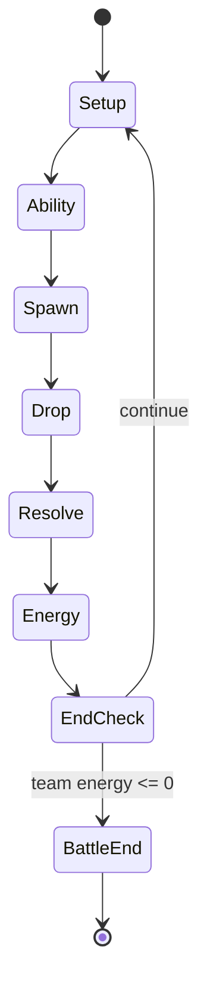
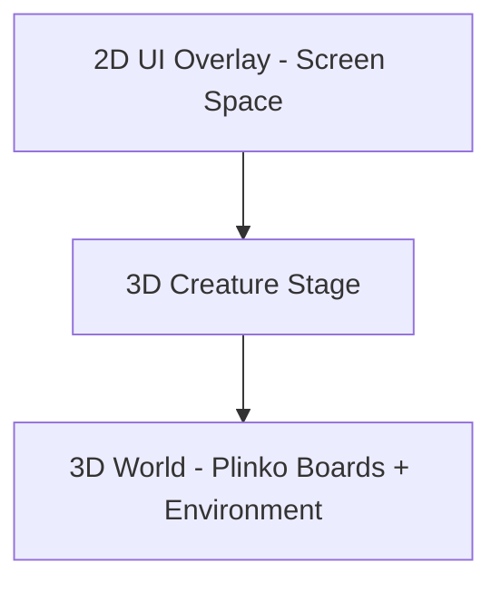

# Pawchinko - Game Design Guide

> Single source of truth for the Pawchinko game vision, gameplay rules, and on-screen layout. Replaces the original `Pawchinko_Full_GDD_Unity.pdf` (which is being deleted). Written for AI coding agents (primary audience) and human designers (secondary audience).

---

## 1. About This Document

> Purpose: define what Pawchinko *is* and how it *plays*, so anyone (AI or human) can build toward the same target.

- **Audience**: AI coding agents first, human designers second. Use plain language, explicit rules, and call out unknowns rather than inventing values.
- **How to use**: read top-to-bottom once. When in doubt during implementation, prefer Sections 2-21 (binding design intent) over Section 22 (suggested architecture).
- **Hard rule**: do not invent mechanics that contradict the **Pinned Design Rules** in Section 19 or the **AI Agent Guardrails** in Section 20.
- **Status of this doc**: living document. Deeper per-system specs (Battle, Board, Ball, Ability, Energy, Creature) will be authored separately later. This guide is the "north star," not the implementation contract.

---

## 2. High Concept

> Elevator pitch for the whole product.

Pawchinko is a hybrid of **creature-collection RPG** and **competitive pachinko battler**. Players explore a top-down world, collect Paw creatures, build teams, and battle other trainers using a physics-driven multi-ball system played on side-by-side plinko boards.

The core innovation is combining **strategy** (team building, queue order, ability choice) with **controlled randomness** (the physics drop on the board).

**Pillar statement**: *"Strategy you choose + controlled randomness you watch."*

**Tone**: cute, vibrant, family-friendly creature collector with competitive depth. Readable at a glance, deep on a second look.

---

## 3. Core Loop

> The macro game flow that every session repeats.

```
Explore -> Encounter -> Battle -> Rewards -> Progression -> Explore
```


- **Explore** - top-down movement across the overworld. Encounter zones (grass, caves, water, etc.) trigger random or fixed encounters.
- **Encounter** - transition into a battle against a wild Paw or rival trainer.
- **Battle** - round-based plinko duel (see Section 4).
- **Rewards** - EXP and likely currency / items / new-creature unlocks. *(TBD: exact reward contents and rates.)*
- **Progression** - apply EXP, level up creatures, unlock new stats / ball counts / abilities.
- Loop back to Explore.

---

## 4. Battle Flow

> What happens inside a single battle, broken down per round.

A battle is a sequence of **rounds**. Each round runs through these phases in order:

1. **Queue / Active Creature Selection** - the player picks which creature(s) act this round and which one is the **Active Creature** (highlighted in the UI, e.g. an indicator arrow next to the active creature's roster row). *(TBD: full queue rules - does the player queue one Active per round while the rest contribute passively, or does the player queue an ordered list? Confirm with design before implementing.)*
2. **Ability Selection** - exactly **one ability** is selected and locked in for this round. *(TBD: scope of selection - is it the active creature's ability only, or chosen from the team's pooled abilities?)*
3. **Ball Spawn** - total balls dropped this round equal the sum of every participating creature's ball-count contribution. Each ball inherits the stats and behavior of the creature that spawned it.
4. **Drop / Physics Resolution** - balls drop through pegs into buckets. From this moment on it is pure physics + already-locked-in modifiers; the player has no further input until resolution completes.
5. **Scoring** - per-ball scores are tallied and summed into a round score for each side.
6. **Energy Update** - applies the round score difference to both teams' energy pools (see Section 6).
7. **End-of-Round Check** - if either team's energy is at or below 0, the battle ends; otherwise advance to the next round.



- **Round end trigger**: every dropped ball has settled in a bucket or exited the board.
- **Battle end trigger**: at least one team's summed energy reaches 0 or below.
- **No fixed round limit.** Battles run as many rounds as it takes for one team's energy to hit zero.

---

## 5. Scene Composition (CRITICAL)

> How the battle scene is built in 3D + 2D layers. This is the most-misinterpreted area, so read carefully.

### Layer breakdown



The scene is composed of three logical layers. Top layers render in front of lower layers.

- **3D World Layer (back)**
  - Two **plinko boards** built as 3D meshes, side by side in world space.
  - Player board on the **left**, tinted **blue / cool**. Enemy board on the **right**, tinted **red / warm**.
  - Soft cloud / sky environment behind both boards.
  - **Pegs** are real round plinko pegs arranged in a triangular / staggered grid. Pegs may include "modifier pegs" with visual states.
  - **Buckets** are 3D containers at the base of each board, each with a base value.
  - Balls are 3D physics objects that drop through this layer.

- **3D Creature Stage Layer (middle)**
  - **5 creature 3D models per side**, arranged vertically along the outer edge of each board (left edge for the player team, right edge for the enemy team).
  - These are real 3D meshes with idle animation, NOT 2D portraits.
  - They react visually to round events (cheer on bucket hits, flinch on enemy abilities, etc.).

- **2D UI Overlay Layer (front)**
  - Screen Space (Overlay or Camera) UI placed above the 3D scene:
    - Round counter (top center).
    - Player team roster strip (left edge): per-row name + level.
    - Enemy team roster strip (right edge): per-row name + level.
    - Active-creature indicator (small arrow / highlight next to the active row in the roster).
    - Active player creature card (bottom-left): portrait, level, name, ball-count badge, and the locked-in ability with its badge.
    - Active enemy creature card (bottom-right): mirrored.
    - Round score readout (bottom-center, e.g. "87 | 72").
    - **DROP** button (bottom-center, above the score readout).
    - Bucket value labels (overlaid above each 3D bucket).

### Camera

- Framed to show **both boards in full**, both creature stages, and leave headroom + bottom margin for the UI overlay.
- Slight forward tilt so the peg field reads cleanly from above.
- No camera switching during the drop; the whole round resolves in one continuous shot.

### Design Clarifications

A few rules that are easy to get wrong - restated here so they're impossible to miss:

- **Exactly 5 creatures per side.** Never 4, never 6.
- **Pegs are round plinko-style pegs**, not stars, sparkles, or abstract dots. Real plinko geometry only.
- **Energy is team-summed.** Per-creature HP bars are explicitly out of scope - do not add them to the roster strips (see Section 6 and Section 20).
- **Ball art is type-themed per source creature.** Generic round-ball / "Pokeball" placeholder visuals are not canonical; balls must read as belonging to their source creature's type.
- **Illustrative values are not canonical.** Any specific creature names, ability names, faction names, bucket numbers, round numbers, or score numbers shown elsewhere in this guide are illustrative examples only. Only positions, components, and counts are binding.

---

## 6. Energy System

> Energy is the win condition. Health for the team, not the individual.

- Displayed during scoring as `Player | Enemy` (e.g. `87 | 72`, illustrative).
- **Team-based**: starting team energy = sum of every creature's `Energy Value` stat at battle start.
- **Per-round formula**:
  - `Difference = PlayerScore - EnemyScore`
  - `PlayerEnergy += Difference`
  - `EnemyEnergy -= Difference`
  - (i.e. the round score difference is awarded to the winner and subtracted from the loser.)
- **Battle ends** when either side's energy drops to 0 or below.
- Individual creatures **do not** have their own HP bars and **cannot be KO'd individually**.
- *(TBD: design may later add temporary "knock-out" or "rotation" mechanics. Treat as out of scope for this guide; do not implement speculatively.)*

---

## 7. Creatures (Paws)

> What a Paw is and what data defines one.

A **Paw** is a collectible creature with identity and progression. Each Paw has the following fields:

- **Type** - one of Fire / Water / Electric / Nature / Chaos (see Section 9).
- **Level** - integer 1 to 50.
- **Energy Value** - the creature's contribution to the team's starting energy pool.
- **AP Cost** - action-point cost to deploy / queue this creature in a round. *(TBD: full AP economy - per-round AP budget, refresh rules, and how AP relates to which creatures can act.)*
- **Stats** - Power, Weight, Luck, Control (see Section 8).
- **Ball Profile** - the data that describes this creature's balls:
  - Ball **type** (matches creature type).
  - Ball **count contribution** per round (scales with level - *exact formula TBD*).
  - Ball **behavior tags** (examples only: bouncy, heavy, splitter, sticky). The exact tag list is a design data set, not fixed here.
- **Abilities** - one or more abilities owned by the creature; one ability is selected per round (selection scope TBD, see Section 12).

Creatures define ball type and per-round ball contribution. Two creatures of the same type but different stats produce balls of the same type with different physical behavior.

---

## 8. Stats

> Four stats, one line each. Keep them legible.

- **Power** - multiplies bucket score on hit.
- **Weight** - affects vertical drop behavior. Heavy = straighter and faster, light = bouncier and wider.
- **Luck** - biases the ball's distribution toward higher-value buckets / zones.
- **Control** - reduces randomness; tightens outcomes around the intended target.

---

## 9. Types

> Types describe identity and behavior. They are NOT a rock-paper-scissors damage table.

- **Fire** - aggressive, edge-focused.
- **Water** - smooth, consistent.
- **Electric** - peg-trigger focused.
- **Nature** - scaling over hits.
- **Chaos** - unpredictable.

> **Hard rule**: types define identity and behavior, NOT direct counters. There are **no type-vs-type damage multipliers**. All counterplay lives in **abilities**, not in passive type matchups.

---

## 10. Ball System

> Balls are the only thing that actually scores. Every other system feeds into how balls behave and how many you get.

- Each creature spawns balls of **its own type**.
- Total balls dropped per round = **sum of all queued creatures' ball contributions**.
- Ball count **scales with level** and varies per creature. *(TBD: exact ball-count scaling formula.)*
- Each ball **carries the stats and behavior** of its source creature throughout its physics lifetime.
- Balls **visually differ by type** so the player can read the board at a glance. (Generic round-ball placeholder art is not canonical; final ball visuals must be type-distinct.)

---

## 11. Board System

> Each side has its own board. Boards are where physics meets design.

- Each player has their **own** board (player on the left, enemy on the right).
- **Pegs**: deflect balls. Some are **modifier pegs** that trigger effects on contact (score boost, status, redirect, etc.).
- **Buckets**: at the bottom of the board, each with a base value. Every ball lands in exactly one bucket (or exits the board if the design allows).
- **Abilities can modify both pegs and buckets**, e.g.:
  - "+0.5 to my edge buckets" (self bucket modifier)
  - "Reduce enemy edge buckets" (enemy bucket modifier)
  - "Mark these pegs for bonus score" (peg modifier)
- Per-board layout (peg arrangement, bucket count, bucket values) is a **design data set**. The example 4-bucket layout with values 10 / 20 / 10 / 25 used elsewhere in this guide is illustrative only. *(TBD: canonical board layouts and per-board parameters.)*

---

## 12. Ability System

> Abilities are the game's primary interaction and counter system.

- **One ability is resolved per round** per side. *(TBD: selection scope - active creature's ability only vs. chosen from team pool.)*
- Abilities are selected **before the drop** and locked in for the round.
- **Categories**:
  - Self buff (e.g. extra balls, bucket boost on own board).
  - Enemy debuff (e.g. shrink enemy buckets).
  - Peg modifier (e.g. mark pegs for bonus, electrify pegs).
  - Bucket modifier (e.g. swap bucket values, +0.5 edges).
  - Chaos effect (e.g. random bucket swap, ball-behavior flip).
- **Illustrative example abilities** (not canonical specs - included only to show the shape an ability can take):
  - "AQUASHOT x4" - likely a self buff that adds extra balls or charges a multi-ball effect.
  - "ROOT TRAP" with a tier / rarity indicator (e.g. 1-3 stars) - likely a peg or bucket trap. The stars likely indicate **rarity or upgrade tier**. *(TBD: confirm what the stars mean.)*

> **Hard rule**: abilities are the primary interaction and counter system. Mechanics that bypass abilities (e.g. passive type counters, hidden auto-buffs) violate the design.

---

## 13. Scoring

> How a number on a board becomes energy damage.

- **Per ball**: `Score = BucketValue * Power * Modifiers`
- **Per round per side**: sum of all ball scores on that side's board.
- Both sides score in **parallel** from their own boards during the same drop.
- The round score feeds the **Energy System** (Section 6) - the *difference* is what matters.

---

## 14. Strategy Layers

> Where the player exercises agency. If a feature doesn't feed one of these, question it.

- **Team composition** - types, stats, role mix.
- **Queue order** across rounds - setup -> combo -> finisher cadence.
- **Per-round ability choice** - the counterplay window.
- **Board interaction** - peg and bucket modifiers shape the physics outcome.

---

## 15. Progression

> How creatures grow and how the collection broadens.

- Creatures level **1 to 50**.
- **EXP gained through battles**.
- Leveling unlocks **stronger stats**, **more balls per round**, and **additional abilities**.
- Players **collect new species** to broaden team-building options.
- Reward contents from battles (currency, items, creature unlocks) - *TBD*.

---

## 16. UI Layout Reference

> Canonical on-screen layout. Spatial positions and the components present are binding; the example labels and numbers below are illustrative only.

- **Top center** - round counter (example label: "ROUND 5"). Just the round number; no other top-bar HUD elements.
- **Left edge** - player team strip:
  - Small faction / team header (example: "Ember").
  - Exactly **5 creature rows**, each showing the creature's portrait, name, and level.
  - **Per-row HP bars are explicitly NOT part of the canonical layout.** Energy is team-summed (see Section 6).
- **Right edge** - enemy team strip, mirrored layout, also exactly 5 rows.
- **Center stage** - the two 3D plinko boards with live ball physics; bucket value labels overlay each 3D bucket.
- **Active creature indicator** - a small arrow or highlight on the currently-acting creature's row in the roster (one per side).
- **Bottom-left card** - active player creature: portrait, level, name, ball-count badge (example: "Lv.20 Aquapp x4"), and the selected ability with its badge / charge count (example: "AQUASHOT x4").
- **Bottom-right card** - active enemy creature, mirrored, with the enemy ability label (example: "ROOT TRAP") and a tier / rarity indicator (example: 3 stars).
- **Bottom center** - the **DROP** button with a downward arrow; current round score readout sits below it (example: "87 | 72").

---

## 17. Art & Audio Direction

> Lightweight direction; not a full art bible.

- **Visual**: cute creature-collector aesthetic, vibrant saturated palette, soft cloud / sky environment, readable iconography.
- **Boards**: clearly themed per side - player **cool / blue**, enemy **warm / red** - so allegiance is readable instantly.
- **Creatures**: expressive 3D chibi-style models. Idle animations always playing. They react to bucket hits, ability triggers, and round wins / losses.
- **UI**: high contrast over the 3D scene. Critical info (energy totals, round score, DROP button) must remain legible at a glance over busy physics action.
- **Audio**: *TBD* - leave room for designer input.

---

## 18. Input & Platform

> Cross-platform from day one; bind specifics later.

- The project ships both **Mobile** and **PC** URP renderer assets, so the game targets both touch and mouse / keyboard (and likely gamepad later).
- Design must remain **input-agnostic**: any battle action must be expressible with a single tap, a single click, or a single button press.
- Specific input bindings - *TBD*.

---

## 19. Pinned Design Rules (Hard Constraints)

> Non-negotiable. Any feature, refactor, or new system must respect every rule below.

> **Types define identity, NOT damage counters.**

> **Abilities create interaction and counterplay.**

> **Ball count defines pressure** (more balls = more board presence).

> **Energy defines victory.**

> **Strategy happens before the drop; physics resolves after the drop.**

> **Randomness is controlled** - the player must always feel agency.

> **Keep systems readable** - avoid hidden complexity and silent RNG.

---

## 20. AI Agent Guardrails

> Explicit do / don't list for AI coding agents working in this repo. If a request would violate one of these, ask the user first.

**Do:**

- **Do** preserve team-summed energy as the only health resource.
- **Do** route all counterplay through abilities, peg modifiers, and bucket modifiers.
- **Do** keep boards as 3D scenes with a 2D UI overlay layer.
- **Do** keep 5 creatures per side on the roster.
- **Do** flag unknowns to the user instead of inventing values for AP cost, ball-count scaling, bucket layouts, ability selection scope, or reward tables.
- **Do** prefer Sections 2-21 over Section 22 when they conflict.

**Don't:**

- **Don't** add per-creature HP bars or per-creature KO logic.
- **Don't** introduce type-vs-type damage multipliers or any rock-paper-scissors counter table.
- **Don't** turn the boards into pure 2D sprites or remove the 3D creature stage.
- **Don't** replace ability counterplay with passive stat checks.
- **Don't** add hidden RNG that the player cannot read or counter.
- **Don't** treat the illustrative example labels in this guide (specific creature names, ability names, faction names, bucket numbers, round numbers) as canonical - only positions, components, and counts are binding.
- **Don't** refactor the code to match the architecture appendix in Section 22 unless the user explicitly asks.

---

## 21. Glossary

- **Paw** - a creature.
- **Energy** - team-summed health / win-condition resource.
- **AP** - Action Points; per-round currency for queueing creatures (full economy *TBD*).
- **Ball Profile** - the data describing a creature's balls (type, count, behavior tags).
- **Round** - one full Setup -> Energy cycle of the battle state machine.
- **Queue** - the per-round ordering / selection of creatures that will contribute balls.
- **Active Creature** - the creature highlighted as primary actor for the current round.
- **Bucket** - a scoring container at the base of a board.
- **Peg** - a deflector on the board; may be a "modifier peg" with effects.
- **Modifier** - any temporary effect on a ball, peg, or bucket.

---

## 22. Appendix: Suggested Unity Architecture (NON-PRESCRIPTIVE)

> **This appendix is an abstract suggestion only.** AI agents and designers should NOT treat it as a hard contract. Implementation details may evolve, and the binding design intent lives in Sections 1-21. **Do not refactor the codebase to match this appendix unless the user explicitly asks.** Per-system technical specs will be authored separately later.

A reasonable starting shape (carried forward from the original GDD so it isn't lost):

- **Layered, data-driven architecture**:
  - **Data layer** - ScriptableObjects for static data (creatures, abilities, types, board layouts).
  - **Runtime systems** - plain C# classes for battle state, scoring, energy, ability resolution.
  - **Presentation layer** - MonoBehaviours for views, animations, UI binding.
  - Strict separation between data, logic, and view.

- **Suggested core systems**:
  - **Battle System** - controls round flow and the battle state machine.
  - **Board System** - manages pegs, buckets, and modifiers.
  - **Ball System** - spawns and simulates balls.
  - **Ability System** - applies effects to board, balls, and creatures.
  - **Energy System** - calculates and applies round results.
  - **Creature System** - manages stats, scaling, and team composition.

- **Suggested state machines**:
  - **Game state**: Boot -> Explore -> Battle -> Rewards.
  - **Battle state**: Setup -> Ability -> Spawn -> Drop -> Resolve -> Energy -> End (or loop back to Setup).

- **Suggested patterns**:
  - **Factory** - spawn balls and runtime objects.
  - **Strategy** - swap ball behaviors and ability effects.
  - **Event Bus** - decouple systems (round events, ability triggers, energy changes).
  - **Service Layer** - shared services (save, audio, etc.).

- **Suggested implementation order** (only when the user asks for an MVP):
  1. Build creature and ability data.
  2. Implement the battle state machine.
  3. Build the board and ball physics.
  4. Implement scoring and energy.
  5. Add ability effects.
  6. Add UI and polish.

- **MVP scope from the original GDD** (use as a sanity check, not a contract):
  - 1 map.
  - 5 to 10 creatures.
  - 5 abilities.
  - Basic board and physics.
  - Energy system.
  - Simple progression.
