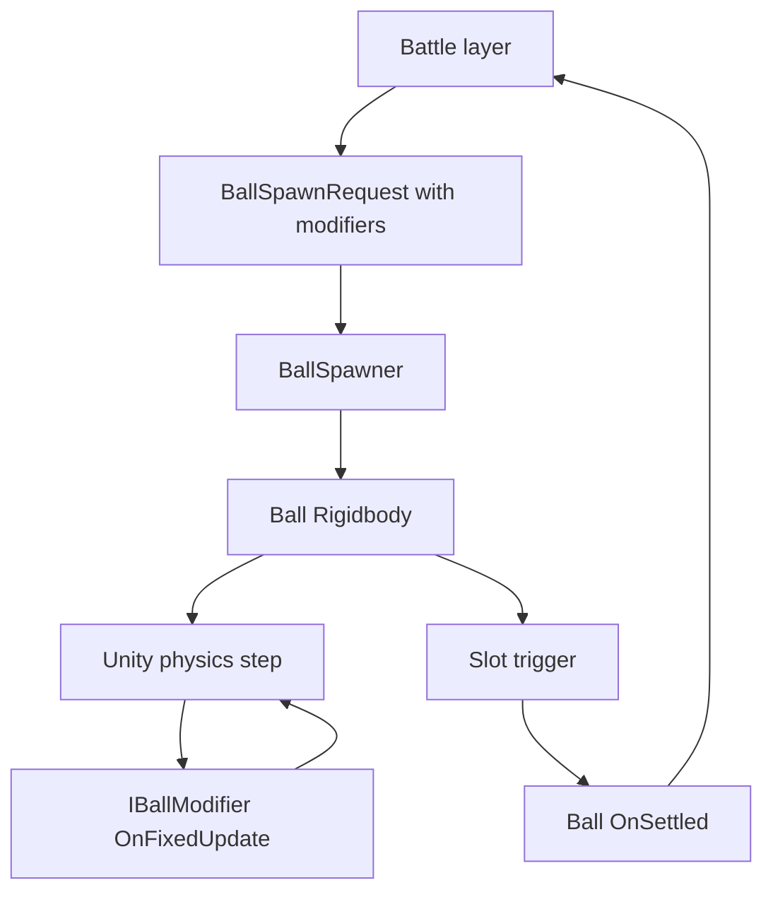

# Pawchinko Physics Drop Guide

> Engineering reference for **physics-driven** ball drops in Pawchinko. Real Unity 3D physics: Rigidbody balls, collider pegs, trigger slots. Balls bump each other, collisions look organic, outcome is whatever slot the ball physically lands in.
>
> Read this before touching the ball, peg, board, slot, or any drop-affecting ability code.

---

## 1. Purpose & how to use this doc

Pawchinko ball drops use **real Unity physics**, not precomputed paths. Every drop is its own little simulation: gravity pulls the ball down, peg colliders bounce it around, balls collide with each other, and the **slot the ball lands in IS the outcome**.

This doc covers:

- Scene + prefab structure for a physics-based board.
- Physics tuning that makes drops look nice (not slidey, not bouncy-forever).
- Multi-ball interaction rules.
- How a drop's outcome is reported (slot trigger -> ball -> battle layer).
- A forward-looking modifier hook system so future pet/creature abilities (peg-magnet fields, tilts, anti-gravity zones, extra-bouncy balls, etc.) plug in cleanly later without rewriting the drop system.

### Hard rules

1. **Never** "snap" a ball to a chosen slot. The slot is emergent, not assigned.
2. **Never** decide an outcome upfront and then try to land the ball there. Outcome only comes from the slot trigger.
3. Abilities are **bias-only**. They apply weak forces or change physics materials; they do not pick slots.

> Important: abilities are NOT being implemented now. The doc just locks in the extension shape so they slot in cleanly later.

---

## 2. Scene structure

The board lives under one root and is built once per battle. The ball prefab is separate so it can be pooled / instantiated freely.

```
Board (GameObject)
+- Pegs/
|  +- Peg_0_0   (SphereCollider + Peg.cs)
|  +- Peg_1_0   (SphereCollider + Peg.cs)
|  +- ...       (one per peg, named by row/col)
+- Walls/
|  +- WallLeft  (BoxCollider)
|  +- WallRight (BoxCollider)
|  +- Funnel    (optional top funnel, BoxColliders)
+- Slots/
|  +- Slot_0    (BoxCollider isTrigger + Slot.cs, slotIndex=0)
|  +- Slot_1    (BoxCollider isTrigger + Slot.cs, slotIndex=1)
|  +- ...       (rows + 1 slots total)
+- BallSpawner  (BallSpawner.cs + spawnPoint Transform child)
+- BallContainer (empty parent for instantiated balls - keeps hierarchy clean)
```

The `Ball` prefab is **not** parented under the board. It is instantiated by `BallSpawner` and parented to `BallContainer`.

---

## 3. Layers and collision matrix

Define five Unity layers (Project Settings -> Tags and Layers):

- `Ball`
- `Peg`
- `Wall`
- `Slot`
- `Field` (used by board-wide ability zones)

Configure the collision matrix (Project Settings -> Physics -> Layer Collision Matrix) so:

- `Ball` collides with: `Ball`, `Peg`, `Wall`.
- `Slot` is trigger-only and only interacts with: `Ball`.
- `Field` is trigger-only and only interacts with: `Ball`.
- `Peg` does **not** collide with itself (no peg-vs-peg pairs).
- `Wall` does **not** collide with itself, `Peg`, `Slot`, or `Field`.

Why: this keeps the broadphase pair count small and makes the trigger-vs-collider intent obvious in script.

---

## 4. Ball prefab

### Components

- `Rigidbody`:
  - `useGravity = true`
  - `mass = 1`
  - `drag = 0.05`
  - `angularDrag = 0.2`
  - `interpolation = Interpolate`
  - `collisionDetectionMode = ContinuousDynamic`
- `SphereCollider` with a tuned `PhysicMaterial`:
  - `bounciness = 0.35`
  - `dynamicFriction = 0.15`
  - `staticFriction = 0.15`
  - `frictionCombine = Average`
  - `bounceCombine = Maximum`
- `Ball` script (id, modifiers list, settled callback).

### Snippet

```csharp
using System.Collections.Generic;
using UnityEngine;

namespace Pawchinko
{
    [RequireComponent(typeof(Rigidbody), typeof(SphereCollider))]
    public class Ball : MonoBehaviour
    {
        public int Id;
        public Rigidbody Body { get; private set; }

        private readonly List<IBallModifier> _modifiers = new();

        private void Awake() => Body = GetComponent<Rigidbody>();

        public void Init(int id, IReadOnlyList<IBallModifier> modifiers)
        {
            Id = id;
            _modifiers.Clear();
            if (modifiers != null) _modifiers.AddRange(modifiers);
            for (int i = 0; i < _modifiers.Count; i++) _modifiers[i].OnSpawn(this);
        }

        private void FixedUpdate()
        {
            for (int i = 0; i < _modifiers.Count; i++) _modifiers[i].OnFixedUpdate(this);
        }

        public void HandleSlotEntered(Slot slot)
        {
            for (int i = 0; i < _modifiers.Count; i++) _modifiers[i].OnSettled(this, slot);
            // Spawner / battle system listens for this; outcome resolution happens elsewhere.
        }
    }
}
```

---

## 5. Peg, Slot, Wall scripts

- **Pegs** are static-lookup objects so modifiers can find the nearest one for fields. No physics work.
- **Slots** fire `OnTriggerEnter` for the first ball that enters and route the result through `Ball`.
- **Walls** are colliders only - no script.

```csharp
using UnityEngine;

namespace Pawchinko
{
    public class Peg : MonoBehaviour
    {
        public int Row;
        public int Col;
    }
}
```

```csharp
using UnityEngine;

namespace Pawchinko
{
    [RequireComponent(typeof(Collider))]
    public class Slot : MonoBehaviour
    {
        public int SlotIndex;

        private void OnTriggerEnter(Collider other)
        {
            if (!other.attachedRigidbody) return;
            var ball = other.attachedRigidbody.GetComponent<Ball>();
            if (ball != null) ball.HandleSlotEntered(this);
        }
    }
}
```

---

## 6. Physics tuning recipe

Starting values. Tweak in the editor; do NOT chase them in code.

- Gravity: keep Unity default `Physics.gravity = (0, -9.81, 0)`. Scale via ball mass instead if you need heavier-feeling balls.
- Fixed timestep: `0.02` is fine for ~30 active balls. Drop to `0.01666` (60Hz) if balls visibly clip pegs.
- Per-ball physic material: `bounciness = 0.35`, `friction = 0.15`. Higher bounciness gets jittery; lower makes the ball flop dead.
- Per-peg physic material: same bounciness, `friction = 0.05` (slippery off pegs).
- `Rigidbody.maxAngularVelocity = 50` (default 7 - low spin looks lifeless).
- Spawn jitter: small random horizontal offset (`+/- 1cm`) and a tiny random torque so successive drops do not look cloned.

```csharp
using System.Collections.Generic;
using UnityEngine;

namespace Pawchinko
{
    public class BallSpawner : MonoBehaviour
    {
        [SerializeField] private Ball ballPrefab;
        [SerializeField] private Transform spawnPoint;
        [SerializeField] private float spawnXJitter = 0.01f;
        [SerializeField] private Vector3 spawnTorqueJitter = new(0.5f, 0f, 0.5f);

        public Ball Spawn(int id, IReadOnlyList<IBallModifier> modifiers)
        {
            Vector3 pos = spawnPoint.position
                          + new Vector3(Random.Range(-spawnXJitter, spawnXJitter), 0f, 0f);
            Ball ball = Instantiate(ballPrefab, pos, Quaternion.identity);
            ball.Init(id, modifiers);
            ball.Body.maxAngularVelocity = 50f;
            ball.Body.AddTorque(new Vector3(
                Random.Range(-spawnTorqueJitter.x, spawnTorqueJitter.x),
                Random.Range(-spawnTorqueJitter.y, spawnTorqueJitter.y),
                Random.Range(-spawnTorqueJitter.z, spawnTorqueJitter.z)
            ), ForceMode.Impulse);
            return ball;
        }
    }
}
```

---

## 7. Outcome resolution

The slot the ball lands in IS the outcome. There is no upstream "predicted slot".

Flow:

1. Ball physically enters a `Slot` trigger collider.
2. `Slot.OnTriggerEnter` -> `Ball.HandleSlotEntered(this)`.
3. `Ball` notifies modifiers and the battle/scoring layer.
4. After a short delay (avoids ball-on-ball pile-ups in a full slot) the ball is despawned.

```csharp
// Pseudocode shape - real listener lives in the battle / scoring layer
void OnBallSettled(Ball ball, Slot slot)
{
    battle.RegisterBallResult(ball.Id, slot.SlotIndex);
    Destroy(ball.gameObject, 0.5f);
}
```

---

## 8. Determinism note (read this once and accept it)

Unity physics is **not** deterministic across frame rates, hardware, or build platforms. Two runs with identical inputs can produce different slot outcomes.

Implications:

- **Never** decide an outcome upfront and then try to land the ball in it. Always read the outcome from the trigger.
- Replays of physics drops require recording trigger results (and optionally `Time.fixedDeltaTime` snapshots) - not seeds.
- If a feature later REQUIRES deterministic outcomes (server-authoritative match results, lockstep multiplayer, etc.), use a different drop system entirely. Do not bolt seeds onto this one.

Accept this trade-off up front: physics gives organic, multi-ball-aware visuals at the cost of strict reproducibility. That is the whole point of choosing physics over a precomputed path.

---

## 9. Modifier hook system (forward-looking, not implemented yet)

Pet/creature abilities will eventually nudge the drop. They plug in via `IBallModifier`.

### 9.1 Bias-only rule

Modifiers are **bias-only**. They never directly set position, set velocity to a target, or pick a slot. They:

- Apply forces (`Rigidbody.AddForce` / `AddTorque`).
- Override the ball's physic material on spawn.
- Attach board-wide trigger zones that affect any ball passing through.

Forces should be **weak**: a tilt bias is a few percent of gravity, not a sideways rocket. Strong forces look like cheating and break believability.

### 9.2 Lifecycle

1. `OnSpawn(Ball)` - one-shot at spawn. Use to apply initial impulses, override physic material, attach VFX hooks.
2. `OnFixedUpdate(Ball)` - per fixed step. Use for continuous forces (peg gravitation, tilt, slow-mo via drag bumps).
3. `OnSettled(Ball, Slot)` - one-shot when the ball enters a slot. Use to clean up zones, log, etc.

### 9.3 Modifier rules (non-negotiable)

- All physics interactions go through `Rigidbody.AddForce` / `AddTorque`. Never assign `velocity` or `position` directly.
- Forces should be a small fraction of gravity. If a modifier needs to overpower gravity, it is the wrong tool - use a board-wide zone instead.
- Modifiers are **stateless across balls**. Per-ball state lives in the `Ball` instance or in a future per-ball `Tags` dictionary.
- Cache references (peg arrays, target lookups) in the modifier constructor. Do not call `FindObjectsOfType` in `OnFixedUpdate`.

### 9.4 Interface and base class

```csharp
using UnityEngine;

namespace Pawchinko
{
    public interface IBallModifier
    {
        void OnSpawn(Ball ball);
        void OnFixedUpdate(Ball ball);
        void OnSettled(Ball ball, Slot slot);
    }

    /// <summary>Default base class so modifiers only override the hooks they need.</summary>
    public abstract class BallModifier : IBallModifier
    {
        public virtual void OnSpawn(Ball ball) { }
        public virtual void OnFixedUpdate(Ball ball) { }
        public virtual void OnSettled(Ball ball, Slot slot) { }
    }
}
```

---

## 10. Worked example: PegGravitationField (cosmetic-ish bias)

Continuously pulls the ball toward the nearest peg with a soft inverse-distance force. Makes the ball "hug" pegs instead of glancing off cleanly. Pure cosmetic feel; the slot the ball ends up in is still emergent.

```csharp
using UnityEngine;

namespace Pawchinko
{
    public sealed class PegGravitationField : BallModifier
    {
        private readonly Peg[] _pegs;
        private readonly float _strength;
        private readonly float _maxDistance;

        public PegGravitationField(Peg[] pegs, float strength, float maxDistance)
        {
            _pegs = pegs;
            _strength = strength;
            _maxDistance = maxDistance;
        }

        public override void OnFixedUpdate(Ball ball)
        {
            Vector3 pos = ball.Body.position;
            Peg nearest = null;
            float bestSq = _maxDistance * _maxDistance;
            for (int i = 0; i < _pegs.Length; i++)
            {
                float d = (_pegs[i].transform.position - pos).sqrMagnitude;
                if (d < bestSq) { bestSq = d; nearest = _pegs[i]; }
            }
            if (nearest == null) return;

            Vector3 toPeg = nearest.transform.position - pos;
            float dist = toPeg.magnitude;
            if (dist < 0.001f) return;
            float falloff = 1f - Mathf.Clamp01(dist / _maxDistance);
            ball.Body.AddForce(toPeg / dist * _strength * falloff, ForceMode.Acceleration);
        }
    }
}
```

---

## 11. Worked example: TiltBias (light side-bias)

Constant gentle horizontal force - the "this pet's drops drift left" trope. Capped to a few percent of gravity so it stays a bias, not a teleport.

```csharp
using UnityEngine;

namespace Pawchinko
{
    public sealed class TiltBias : BallModifier
    {
        private readonly Vector3 _force;

        public TiltBias(float horizontalAcceleration)
        {
            float capped = Mathf.Clamp(horizontalAcceleration, -2f, 2f);
            _force = new Vector3(capped, 0f, 0f);
        }

        public override void OnFixedUpdate(Ball ball)
        {
            ball.Body.AddForce(_force, ForceMode.Acceleration);
        }
    }
}
```

---

## 12. Worked example: ExtraBouncyBall (physics material override)

Swaps the collider's physic material on spawn. Demonstrates one-shot setup that does not need per-frame work.

```csharp
using UnityEngine;

namespace Pawchinko
{
    public sealed class ExtraBouncyBall : BallModifier
    {
        private readonly PhysicMaterial _material;

        public ExtraBouncyBall(PhysicMaterial bouncyMaterial)
        {
            _material = bouncyMaterial;
        }

        public override void OnSpawn(Ball ball)
        {
            var col = ball.GetComponent<Collider>();
            if (col != null) col.sharedMaterial = _material;
        }
    }
}
```

---

## 13. Worked example: AntiGravityZone (board-side modifier, not per-ball)

Some abilities are board-wide rather than per-ball - e.g. a zone collider on the `Field` layer that reduces gravity on any ball inside it. Implemented as a separate `MonoBehaviour` zone; balls do not need to know about it.

```csharp
using System.Collections.Generic;
using UnityEngine;

namespace Pawchinko
{
    [RequireComponent(typeof(Collider))]
    public class AntiGravityZone : MonoBehaviour
    {
        [SerializeField] private float gravityScaleInside = 0.4f;
        private readonly HashSet<Rigidbody> _inside = new();

        private void OnTriggerEnter(Collider other)
        {
            if (other.attachedRigidbody) _inside.Add(other.attachedRigidbody);
        }

        private void OnTriggerExit(Collider other)
        {
            if (other.attachedRigidbody) _inside.Remove(other.attachedRigidbody);
        }

        private void FixedUpdate()
        {
            Vector3 counter = -Physics.gravity * (1f - gravityScaleInside);
            foreach (var rb in _inside) rb.AddForce(counter, ForceMode.Acceleration);
        }
    }
}
```

---

## 14. Where modifiers come from

A `BallSpawnRequest` (built upstream by the battle / ability system) carries:

- The ball id.
- A flat `IReadOnlyList<IBallModifier>` aggregated from active creature passives, the active ability for the round, and any arena-wide modifiers.

`BallSpawner.Spawn(id, modifiers)` instantiates the ball, wires the modifier list, applies spawn jitter, and returns the `Ball` reference.

Board-wide zones (`AntiGravityZone`, etc.) are spawned/enabled by the same battle layer - they are NOT part of the per-ball modifier list. Per-ball modifiers do not know about zones, and zones do not know which balls are "theirs".

---

## 15. Performance notes

- Ball-vs-ball collisions are O(n^2) in the worst case for small `n`; Unity handles ~50 active balls cheaply on desktop targets. Cap concurrent balls per battle accordingly.
- Use `Rigidbody.interpolation = Interpolate` only on visible balls; offscreen warmup / queued balls can skip it.
- Avoid per-frame allocations in modifier `OnFixedUpdate`. Cache arrays in the constructor.
- The peg list passed to `PegGravitationField` should be cached once after the board builds; do not call `FindObjectsOfType<Peg>()` inside `OnFixedUpdate`.
- Slot triggers should NOT have a Rigidbody. Static triggers are dramatically cheaper than kinematic-Rigidbody triggers.
- If you need spatial peg lookup with many balls, replace the linear `PegGravitationField` scan with a grid bucket built once at board init.

---

## 16. Architecture diagram



---

## 17. Checklist for AI agents touching the physics drop system

- [ ] Did you add new physics interaction via `AddForce` / `AddTorque` only? No `velocity =` or `position =` writes?
- [ ] Did you keep modifier forces weak (a small fraction of gravity)? No instant snaps?
- [ ] Did you cache references in the modifier constructor instead of `FindObjectsOfType` in `OnFixedUpdate`?
- [ ] Are colliders on the right layer (`Ball`, `Peg`, `Wall`, `Slot`, `Field`)?
- [ ] Are Slot colliders trigger-only and Rigidbody-free?
- [ ] Did you avoid declaring an outcome upfront? (Outcome must come from `Slot.OnTriggerEnter`.)
- [ ] Did you avoid coupling this system to any seed/RNG-based determinism assumption?
- [ ] If the new ability is board-wide, is it a zone `MonoBehaviour` rather than a per-ball modifier?
- [ ] Per-ball state lives on `Ball` only - modifiers stay stateless across balls?
