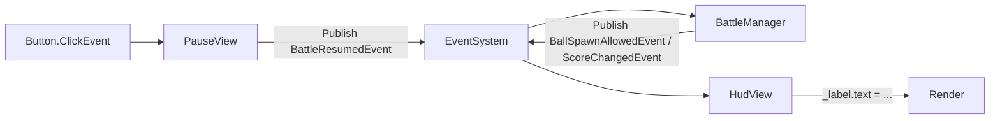

# UI Toolkit — Components, Manipulators, Bindings, Events

> Doc 3 of 3. Companions: [UI_TOOLKIT_OVERVIEW.md](UI_TOOLKIT_OVERVIEW.md) · [UI_TOOLKIT_USS.md](UI_TOOLKIT_USS.md).

This doc covers the **behavior layer** — how to author reusable custom controls, how to react to user input via manipulators, how to bind data to UI, how to virtualize lists, how to anchor UI to world-space objects, and how to glue all of it into Pawchinko's `EventSystem`. Every code block is inline and runnable.

---

## How to read this file

- §2 — when to make a custom control vs use a UXML template.
- §3 / §5 / §6 — three full custom-control examples (`HealthBarComponent`, `SlideToggle`, `RadialProgress`). Read these in order; together they cover the API surface.
- §7 — manipulators (drag, hold).
- §8 — runtime data binding.
- §9 — `ListView` virtualization.
- §10 — world-space anchoring.
- §11 — `schedule.Execute` patterns.
- §12 — event flow with Pawchinko's `EventSystem`.
- §14 — hallucination guard.

---

## 1. Conventions

- Every custom control:
  - Lives under `Scripts/UI/Components/` per code guide §4.
  - Uses `[UxmlElement]` + `partial class` (Unity 6 attribute-based form, **not** the deprecated `UxmlFactory` / `UxmlTraits` API).
  - Declares its USS class names in a nested `static class ClassNames` block.
  - Has a matching `Assets/UI/Uss/Components/<ControlName>.uss`.
- Every control's USS class names follow BEM (USS doc §5).
- Pawchinko C# style: Allman braces, `Pawchinko.UI` namespace, `_camelCase` runtime fields, `[ClassName]` log prefix.

---

## 2. When to make a custom control

Decision tree:

1. **Can plain UXML + a USS class do it?** -> Use a UXML template under `Assets/UI/Uxml/Components/Foo.uxml`. No C# needed.
2. **Needs runtime data binding or custom drawing?** -> Make a `VisualElement` subclass with `[UxmlElement]`.
3. **Acts like a form field (has a value, fires `ChangeEvent`)?** -> Derive from `BaseField<T>`.
4. **Needs custom rendering (arcs, paths, shaders)?** -> `VisualElement` + `generateVisualContent` callback (§6).

---

## 3. `HealthBarComponent` — `[UxmlElement] : VisualElement`

A reusable progress bar with a title and current/max readout. Demonstrates:
- `[UxmlElement] partial class`
- `[UxmlAttribute]` for author-time-tunable fields
- `[CreateProperty]` for runtime data binding
- BEM class names + `EnableInClassList` for state-driven styling

```csharp
using Unity.Properties;
using UnityEngine;
using UnityEngine.UIElements;

namespace Pawchinko.UI
{
    /// <summary>
    /// Reusable progress bar with a title and current/max readout.
    /// USS hooks: .health-bar, .health-bar__background, .health-bar__progress,
    /// .health-bar__progress--low, .health-bar__title, .health-bar__label.
    /// </summary>
    [UxmlElement]
    public partial class HealthBarComponent : VisualElement
    {
        private static class ClassNames
        {
            public const string Container  = "health-bar";
            public const string Background = "health-bar__background";
            public const string Progress   = "health-bar__progress";
            public const string Label      = "health-bar__label";
            public const string Title      = "health-bar__title";
            public const string Low        = "health-bar__progress--low";
        }

        private readonly Label _titleLabel;
        private readonly Label _readout;
        private readonly VisualElement _progress;

        private string _title;
        private float _current;
        private float _max = 100f;

        [UxmlAttribute("HealthBarTitle")]
        public string HealthBarTitle
        {
            get => _title;
            set
            {
                _title = value;
                if (_titleLabel != null) _titleLabel.text = value;
            }
        }

        [UxmlAttribute, CreateProperty]
        public float Current
        {
            get => _current;
            set { _current = value; UpdateBar(); }
        }

        [UxmlAttribute, CreateProperty]
        public float Max
        {
            get => _max;
            set { _max = value; UpdateBar(); }
        }

        public HealthBarComponent()
        {
            AddToClassList(ClassNames.Container);

            VisualElement bg = new VisualElement { name = "Background" };
            bg.AddToClassList(ClassNames.Background);
            Add(bg);

            _progress = new VisualElement { name = "Progress" };
            _progress.AddToClassList(ClassNames.Progress);
            bg.Add(_progress);

            _titleLabel = new Label { name = "Title" };
            _titleLabel.AddToClassList(ClassNames.Title);
            Add(_titleLabel);

            _readout = new Label { name = "Readout" };
            _readout.AddToClassList(ClassNames.Label);
            bg.Add(_readout);

            UpdateBar();
        }

        private void UpdateBar()
        {
            float pct = _max > 0f ? Mathf.Clamp01(_current / _max) : 0f;
            _progress.style.width = Length.Percent(pct * 100f);
            _progress.EnableInClassList(ClassNames.Low, pct < 0.25f);
            if (_readout != null) _readout.text = $"{_current:0}/{_max:0}";
        }
    }
}
```

UXML usage:

```xml
<ui:UXML xmlns:ui="UnityEngine.UIElements" xmlns:pw="Pawchinko.UI">
    <Style src="project://database/Assets/UI/Uss/Components/HealthBar.uss" />
    <pw:HealthBarComponent name="PlayerHealth" HealthBarTitle="HERO" Current="80" Max="100" />
</ui:UXML>
```

Matching USS:

```css
.health-bar {
    align-items: center;
    flex-direction: column;
    max-width: 20%;
    max-height: 10%;
}
.health-bar__background {
    background-image: url('project://database/Assets/UI/Sprites/UI_atlas.psd#hp_bg');
    height: 31px;
    width: 198px;
    padding: 5px;
    -unity-background-scale-mode: stretch-to-fill;
    align-items: flex-start;
    flex-direction: column;
}
.health-bar__progress {
    background-image: url('project://database/Assets/UI/Sprites/UI_atlas.psd#hp_juice');
    -unity-background-image-tint-color: var(--color-success);
    height: 100%;
    max-width: 100%;
    transition-property: width, -unity-background-image-tint-color;
    transition-duration: 0.2s, 0.2s;
}
.health-bar__progress--low {
    -unity-background-image-tint-color: var(--color-danger);
}
.health-bar__label {
    position: absolute;
    top: -16px; left: 12px;
    color: var(--color-text);
    font-size: var(--font-size-md);
}
.health-bar__title {
    color: var(--color-text);
    font-size: var(--font-size-md);
    -unity-text-align: upper-center;
}
```

C# update from a manager:

```csharp
var bar = root.Q<HealthBarComponent>("PlayerHealth");
bar.Current = playerData.CurrentHp;
bar.Max     = playerData.MaxHp;
```

---

## 4. Authoring custom controls — gotchas

- **`partial`** keyword is mandatory — Unity generates code on the other half (constructor for the UxmlObject definition, etc.).
- **Default constructor** must exist (no required ctor params) so UXML can instantiate.
- **`[UxmlAttribute]` setters** can be called *before* the constructor finishes building child elements (UXML attribute order isn't guaranteed). Null-check helpers in setters.
- **`[UxmlAttribute("AttrName")]`** lets you rename the UXML attribute vs the C# property name. Without an argument, Unity uses the property name as-is.
- **`[CreateProperty]`** is required for runtime data binding via `dataSource`. Stack with `[UxmlAttribute]` to make a field both author-time and bindable.
- **C# children vs UXML children** — by default, children added in UXML go inside your element's `contentContainer`. If you need a different layout (e.g. children should land inside a specific named child), override `contentContainer` (advanced, rarely needed).

---

## 5. `SlideToggle` — `BaseField<T>`

A switch-style toggle. Demonstrates:
- Deriving from `BaseField<bool>` so the control integrates with binding/forms and fires `ChangeEvent<bool>` via `value`.
- Multiple input modalities (mouse click, gamepad submit, keyboard).
- USS-only animation of the knob via class swap.

```csharp
using UnityEngine;
using UnityEngine.UIElements;

namespace Pawchinko.UI
{
    /// <summary>
    /// Switch-style toggle. Derives from BaseField{bool} so it integrates with
    /// binding/forms and fires ChangeEvent{bool} via base.value.
    /// </summary>
    [UxmlElement]
    public partial class SlideToggle : BaseField<bool>
    {
        public new static readonly string ussClassName       = "slide-toggle";
        public new static readonly string inputUssClassName  = "slide-toggle__input";
        public      static readonly string inputKnobClass    = "slide-toggle__input-knob";
        public      static readonly string inputCheckedClass = "slide-toggle__input--checked";
        public      static readonly string stateLabelClass   = "slide-toggle__state-label";

        [UxmlAttribute] public string OnLabel  { get; set; } = "On";
        [UxmlAttribute] public string OffLabel { get; set; } = "Off";

        private readonly VisualElement _input;
        private readonly VisualElement _knob;
        private readonly Label _stateLabel;

        public SlideToggle() : this(null) { }

        public SlideToggle(string label) : base(label, null)
        {
            AddToClassList(ussClassName);

            _input = this.Q(className: BaseField<bool>.inputUssClassName);
            _input.AddToClassList(inputUssClassName);

            _knob = new VisualElement();
            _knob.AddToClassList(inputKnobClass);
            _input.Add(_knob);

            _stateLabel = new Label();
            _stateLabel.AddToClassList(stateLabelClass);
            _input.Add(_stateLabel);

            RegisterCallback<ClickEvent>(OnClick);
            RegisterCallback<NavigationSubmitEvent>(OnSubmit);
            RegisterCallback<KeyDownEvent>(OnKeyDown);

            UpdateLabel();
        }

        private static void OnClick(ClickEvent evt)
        {
            (evt.currentTarget as SlideToggle)?.Toggle();
            evt.StopPropagation();
        }

        private static void OnSubmit(NavigationSubmitEvent evt)
        {
            (evt.currentTarget as SlideToggle)?.Toggle();
            evt.StopPropagation();
        }

        private static void OnKeyDown(KeyDownEvent evt)
        {
            if (evt.currentTarget is not SlideToggle st) return;

            // At runtime, NavigationSubmitEvent already covers Enter/Space.
            if (st.panel?.contextType == ContextType.Player) return;

            if (evt.keyCode is KeyCode.Return or KeyCode.KeypadEnter or KeyCode.Space)
            {
                st.Toggle();
                evt.StopPropagation();
            }
        }

        private void Toggle()
        {
            value = !value;
            UpdateLabel();
        }

        public override void SetValueWithoutNotify(bool newValue)
        {
            base.SetValueWithoutNotify(newValue);
            _input.EnableInClassList(inputCheckedClass, newValue);
            UpdateLabel();
        }

        private void UpdateLabel()
        {
            _stateLabel.text = value ? OnLabel : OffLabel;
        }
    }
}
```

USS:

```css
.slide-toggle__input {
    width: 64px; height: 28px;
    border-radius: 14px;
    background-color: var(--color-surface);
    transition-property: background-color;
    transition-duration: 0.25s;
}
.slide-toggle__input--checked {
    background-color: var(--color-accent);
}
.slide-toggle__input-knob {
    width: 24px; height: 24px;
    border-radius: 12px;
    background-color: white;
    translate: 2px 0;
    transition-property: translate;
    transition-duration: 0.25s;
}
.slide-toggle__input--checked > .slide-toggle__input-knob {
    translate: 38px 0;
}
.slide-toggle:focus .slide-toggle__input-knob {
    border-width: 1px;
    border-color: var(--color-accent-hot);
}
.slide-toggle__state-label {
    font-size: var(--font-size-sm);
    color: var(--color-text-muted);
    -unity-text-align: middle-right;
}
```

UXML and C# subscription:

```xml
<pw:SlideToggle name="settings__sound-toggle" label="Sound" OnLabel="ON" OffLabel="OFF" />
```

```csharp
var soundToggle = root.Q<SlideToggle>("settings__sound-toggle");
soundToggle.RegisterValueChangedCallback(evt =>
{
    GameManager.Instance.EventSystem.Publish(new SoundEnabledChangedEvent(evt.newValue));
});
```

---

## 6. `RadialProgress` — custom drawing with `painter2D`

A circular progress indicator drawn via the Vector API. Demonstrates:
- `generateVisualContent` callback for custom rendering.
- `MarkDirtyRepaint()` to trigger redraws.
- USS custom properties (`--track-color`, `--progress-color`) read in C#.

```csharp
using Unity.Properties;
using UnityEngine;
using UnityEngine.UIElements;

namespace Pawchinko.UI
{
    /// <summary>
    /// Circular progress indicator drawn with the Vector API.
    /// USS variables: --track-color, --progress-color.
    /// </summary>
    [UxmlElement]
    public partial class RadialProgress : VisualElement
    {
        private static class ClassNames
        {
            public const string Root  = "radial-progress";
            public const string Label = "radial-progress__label";
        }

        private static readonly CustomStyleProperty<Color> s_TrackColor    = new("--track-color");
        private static readonly CustomStyleProperty<Color> s_ProgressColor = new("--progress-color");

        private Color _trackColor    = Color.black;
        private Color _progressColor = Color.red;
        private readonly Label _label;
        private float _progress;

        [UxmlAttribute, CreateProperty]
        public float Progress
        {
            get => _progress;
            set
            {
                _progress = value;
                _label.text = $"{Mathf.Clamp(Mathf.Round(value), 0, 100)}%";
                MarkDirtyRepaint();
            }
        }

        public RadialProgress()
        {
            AddToClassList(ClassNames.Root);

            _label = new Label();
            _label.AddToClassList(ClassNames.Label);
            Add(_label);

            RegisterCallback<CustomStyleResolvedEvent>(OnCustomStylesResolved);
            generateVisualContent += GenerateVisualContent;
            Progress = 0f;
        }

        private void OnCustomStylesResolved(CustomStyleResolvedEvent evt)
        {
            bool repaint = false;
            if (evt.customStyle.TryGetValue(s_TrackColor,    out _trackColor))    repaint = true;
            if (evt.customStyle.TryGetValue(s_ProgressColor, out _progressColor)) repaint = true;
            if (repaint) MarkDirtyRepaint();
        }

        private void GenerateVisualContent(MeshGenerationContext ctx)
        {
            float w = contentRect.width;
            float h = contentRect.height;
            Painter2D p = ctx.painter2D;
            p.lineWidth = 10f;
            p.lineCap = LineCap.Butt;

            p.strokeColor = _trackColor;
            p.BeginPath();
            p.Arc(new Vector2(w * 0.5f, h * 0.5f), w * 0.5f, 0f, 360f);
            p.Stroke();

            p.strokeColor = _progressColor;
            p.BeginPath();
            p.Arc(new Vector2(w * 0.5f, h * 0.5f), w * 0.5f, -90f, 360f * (_progress / 100f) - 90f);
            p.Stroke();
        }
    }
}
```

USS:

```css
.radial-progress {
    --track-color: rgb(60, 60, 60);
    --progress-color: var(--color-accent);
    width: 96px;
    height: 96px;
    align-items: center;
    justify-content: center;
}
.radial-progress__label {
    color: var(--color-text);
    font-size: var(--font-size-sm);
}
.radial-progress--danger {
    --progress-color: var(--color-danger);
}
```

UXML:

```xml
<pw:RadialProgress name="cooldown" Progress="50" />
```

`Painter2D` also has: `BeginPath`, `MoveTo`, `LineTo`, `BezierCurveTo`, `QuadraticCurveTo`, `Arc`, `ArcTo`, `ClosePath`, `Stroke`, `Fill`, `fillColor`, `strokeColor`, `lineWidth`, `lineCap`, `lineJoin`, `miterLimit`. Useful for cooldown rings, mana arcs, simple icons.

---

## 7. Manipulators — `PointerManipulator`

Manipulators encapsulate input handling. Attach with `element.AddManipulator(new MyManipulator(...))`.

### Hold-to-fire

Fires after the user holds the target for `holdSeconds`. Cancelled if pointer leaves or releases.

```csharp
using System;
using UnityEngine.UIElements;

namespace Pawchinko.UI
{
    /// <summary>
    /// Fires OnHoldComplete after the user holds the target for holdSeconds.
    /// Cancelled if pointer leaves or releases.
    /// </summary>
    public class HoldManipulator : PointerManipulator
    {
        public event Action OnHoldComplete;

        private readonly float _holdSeconds;
        private IVisualElementScheduledItem _timer;

        public HoldManipulator(VisualElement target, float holdSeconds)
        {
            this.target = target;
            _holdSeconds = holdSeconds;
        }

        protected override void RegisterCallbacksOnTarget()
        {
            target.RegisterCallback<PointerDownEvent>(OnDown);
            target.RegisterCallback<PointerUpEvent>(OnCancel);
            target.RegisterCallback<PointerLeaveEvent>(OnCancel);
        }

        protected override void UnregisterCallbacksFromTarget()
        {
            target.UnregisterCallback<PointerDownEvent>(OnDown);
            target.UnregisterCallback<PointerUpEvent>(OnCancel);
            target.UnregisterCallback<PointerLeaveEvent>(OnCancel);
        }

        private void OnDown(PointerDownEvent _)
        {
            _timer?.Pause();
            _timer = target.schedule.Execute(() => OnHoldComplete?.Invoke())
                                    .StartingIn((long)(_holdSeconds * 1000));
        }

        private void OnCancel(EventBase _)
        {
            _timer?.Pause();
            _timer = null;
        }
    }
}
```

Usage:

```csharp
var hold = new HoldManipulator(_launchButton, 0.6f);
hold.OnHoldComplete += OnLaunch;
_launchButton.AddManipulator(hold);
```

### Drag

A draggable element that follows the pointer while held. Pair with drop-zone elements for full drag-and-drop.

```csharp
using UnityEngine;
using UnityEngine.UIElements;

namespace Pawchinko.UI
{
    /// <summary>
    /// Makes the target draggable. Captures the pointer on PointerDown and
    /// translates the element by the cursor delta.
    /// </summary>
    public class DragManipulator : PointerManipulator
    {
        private bool _enabled;
        private Vector3 _startPos;
        private Vector2 _pointerStart;

        public DragManipulator(VisualElement target) { this.target = target; }

        protected override void RegisterCallbacksOnTarget()
        {
            target.RegisterCallback<PointerDownEvent>(OnDown);
            target.RegisterCallback<PointerMoveEvent>(OnMove);
            target.RegisterCallback<PointerUpEvent>(OnUp);
        }

        protected override void UnregisterCallbacksFromTarget()
        {
            target.UnregisterCallback<PointerDownEvent>(OnDown);
            target.UnregisterCallback<PointerMoveEvent>(OnMove);
            target.UnregisterCallback<PointerUpEvent>(OnUp);
        }

        private void OnDown(PointerDownEvent evt)
        {
            _startPos = target.transform.position;
            _pointerStart = evt.position;
            _enabled = true;
            target.CapturePointer(evt.pointerId);
        }

        private void OnMove(PointerMoveEvent evt)
        {
            if (!_enabled || !target.HasPointerCapture(evt.pointerId)) return;
            Vector2 delta = (Vector2)evt.position - _pointerStart;
            target.transform.position = _startPos + (Vector3)delta;
        }

        private void OnUp(PointerUpEvent evt)
        {
            if (!_enabled || !target.HasPointerCapture(evt.pointerId)) return;
            target.ReleasePointer(evt.pointerId);
            _enabled = false;
        }
    }
}
```

### Drop zones

A drop zone is just a rect-test against the dragged element on `PointerUp`. Sketch:

```csharp
private void OnUp(PointerUpEvent evt)
{
    if (!_enabled || !target.HasPointerCapture(evt.pointerId)) return;
    target.ReleasePointer(evt.pointerId);
    _enabled = false;

    Vector2 worldPoint = evt.position;
    foreach (VisualElement zone in _dropZones)
    {
        if (zone.worldBound.Contains(worldPoint))
        {
            GameManager.Instance.EventSystem.Publish(new ItemDroppedOnZoneEvent(/*...*/));
            break;
        }
    }
    target.transform.position = _startPos; // snap back; or commit position
}
```

---

## 8. Runtime data binding

UI Toolkit's runtime binding system links a `VisualElement` to a data object. Properties tagged `[CreateProperty]` are visible to the binding engine.

### Plain data binding

Define a plain data class with `[CreateProperty]` on its public properties:

```csharp
using Unity.Properties;

namespace Pawchinko
{
    public class HealthData
    {
        [CreateProperty] public float Current { get; set; }
        [CreateProperty] public float Max     { get; set; }
    }
}
```

Set the data source at runtime:

```csharp
var bar = root.Q<HealthBarComponent>("PlayerHealth");
bar.dataSource = healthData;
bar.SetBinding(nameof(HealthBarComponent.Current),
               new DataBinding { dataSourcePath = new PropertyPath(nameof(HealthData.Current)) });
bar.SetBinding(nameof(HealthBarComponent.Max),
               new DataBinding { dataSourcePath = new PropertyPath(nameof(HealthData.Max)) });
```

After this, mutating `healthData.Current` automatically pushes to the bar on the next frame.

### Custom binding — `AnimatedTextBinding`

A custom binding that lerps a `Label`'s text from the previous value to the new value over `_animationDuration` seconds whenever the bound source changes. Useful for currency counters, score readouts.

```csharp
using Unity.Properties;
using UnityEngine;
using UnityEngine.UIElements;

namespace Pawchinko.UI
{
    /// <summary>
    /// Custom binding that lerps a Label's text from the previous value to the new value
    /// over _animationDuration seconds whenever the bound source changes.
    /// </summary>
    [UxmlObject]
    public partial class AnimatedTextBinding : CustomBinding, IDataSourceProvider
    {
        public object dataSource { get; set; }
        public PropertyPath dataSourcePath { get; set; }

        private readonly float _animationDuration = 0.5f;
        private uint _currentValue;
        private uint _targetValue;
        private bool _isAnimating;
        private float _animationStart;

        public AnimatedTextBinding()
        {
            updateTrigger = BindingUpdateTrigger.OnSourceChanged;
        }

        protected override BindingResult Update(in BindingContext context)
        {
            if (context.targetElement is not Label label)
            {
                return new BindingResult(BindingStatus.Failure,
                    "[AnimatedTextBinding] target element is not a Label");
            }

            if (!TryGetUInt(out uint newValue))
            {
                return new BindingResult(BindingStatus.Failure,
                    "[AnimatedTextBinding] failed to read uint from data source");
            }

            if (newValue == _targetValue) return new BindingResult(BindingStatus.Success);

            _currentValue = _isAnimating ? GetCurrent() : _targetValue;
            _targetValue = newValue;
            _animationStart = Time.realtimeSinceStartup;
            _isAnimating = true;
            Animate(label);
            return new BindingResult(BindingStatus.Success);
        }

        private void Animate(Label label)
        {
            if (!_isAnimating) return;

            float t = Mathf.Clamp01((Time.realtimeSinceStartup - _animationStart) / _animationDuration);
            uint v = (uint)Mathf.Lerp(_currentValue, _targetValue, t);
            label.text = v.ToString();

            if (t >= 1f)
            {
                _currentValue = _targetValue;
                _isAnimating = false;
                return;
            }

            label.schedule.Execute(() => Animate(label)).StartingIn(0);
        }

        private uint GetCurrent()
        {
            float t = Mathf.Clamp01((Time.realtimeSinceStartup - _animationStart) / _animationDuration);
            return (uint)Mathf.Lerp(_currentValue, _targetValue, t);
        }

        private bool TryGetUInt(out uint value)
        {
            value = 0;
            if (dataSource == null) return false;
            if (PropertyContainer.TryGetValue(dataSource, dataSourcePath, out object obj) && obj is uint u)
            {
                value = u;
                return true;
            }
            return false;
        }
    }
}
```

Usage:

```csharp
_goldLabel.SetBinding("text", new AnimatedTextBinding
{
    dataSource = gameData,
    dataSourcePath = new PropertyPath(nameof(GameData.Gold)),
});

_gemLabel.SetBinding("text", new AnimatedTextBinding
{
    dataSource = gameData,
    dataSourcePath = new PropertyPath(nameof(GameData.Gems)),
});
```

`[UxmlObject]` lets the binding be authored from UI Builder. `BindingUpdateTrigger.OnSourceChanged` runs `Update` only when the source value actually changes (cheaper than per-frame).

---

## 9. `ListView` — virtualized lists

For inventory, battle log, mail, etc. `ListView` recycles rows.

```csharp
using System.Collections.Generic;
using UnityEngine;
using UnityEngine.UIElements;

namespace Pawchinko.UI
{
    public class InventoryView : UIView
    {
        private ListView _list;
        private List<ItemData> _items;

        public InventoryView(VisualElement root, List<ItemData> items) : base(root)
        {
            _items = items;
        }

        protected override void SetVisualElements()
        {
            _list = root.Q<ListView>("inventory__list");
            _list.itemsSource = _items;
            _list.fixedItemHeight = 72;
            _list.makeItem  = MakeRow;
            _list.bindItem  = BindRow;
            _list.unbindItem = UnbindRow;
            _list.selectionType = SelectionType.Single;
            _list.selectionChanged += OnSelectionChanged;
        }

        private VisualElement MakeRow()
        {
            var row = new VisualElement();
            row.AddToClassList("inventory-row");
            row.Add(new VisualElement { name = "icon" });
            row.Add(new Label { name = "name" });
            row.Add(new Label { name = "count" });
            return row;
        }

        private void BindRow(VisualElement row, int index)
        {
            ItemData item = _items[index];
            row.Q<VisualElement>("icon").style.backgroundImage = new StyleBackground(item.Icon);
            row.Q<Label>("name").text  = item.Name;
            row.Q<Label>("count").text = item.Count.ToString();
        }

        private void UnbindRow(VisualElement row, int index)
        {
            row.Q<VisualElement>("icon").style.backgroundImage = StyleKeyword.Null;
            row.Q<Label>("name").text  = string.Empty;
            row.Q<Label>("count").text = string.Empty;
        }

        private void OnSelectionChanged(IEnumerable<object> selection)
        {
            foreach (object obj in selection)
            {
                if (obj is ItemData item)
                {
                    GameManager.Instance.EventSystem.Publish(new ItemSelectedEvent(item));
                }
            }
        }
    }
}
```

UXML:

```xml
<ui:ListView name="inventory__list" />
```

Rules:
- `unbindItem` is **required** if `bindItem` registers callbacks or holds references — rows are recycled and stale handlers leak.
- `fixedItemHeight` lets ListView virtualize. For variable heights, use `virtualizationMethod = CollectionVirtualizationMethod.DynamicHeight` (more expensive).
- Refresh after the source list changes: `_list.RefreshItems();` or `_list.Rebuild();` (full rebuild).

---

## 10. World-space anchoring — `RuntimePanelUtils`

Anchor a UI element to a 3D world position (e.g. health bar above a unit, damage number, drop-zone marker).

```csharp
using UnityEngine;
using UnityEngine.UIElements;

namespace Pawchinko.UI
{
    /// <summary>
    /// Positions a VisualElement so its bottom-center aligns with a world position
    /// projected through the given camera. Call from LateUpdate.
    /// </summary>
    public static class WorldAnchor
    {
        public static void MoveToWorldPosition(
            VisualElement element,
            Vector3 worldPos,
            Vector2 worldSize,
            Camera cam)
        {
            if (element == null || cam == null) return;
            if (element.panel == null) return;

            Rect rect = RuntimePanelUtils.CameraTransformWorldToPanelRect(
                element.panel, worldPos, worldSize, cam);

            float w = element.contentRect.width;
            float h = element.contentRect.height;
            if (w <= 0f || h <= 0f) return;

            element.style.left = rect.xMin - (w / 2f);
            element.style.top  = rect.yMin - h;
        }
    }
}
```

Usage from a `MonoBehaviour` on the unit:

```csharp
private void LateUpdate()
{
    WorldAnchor.MoveToWorldPosition(_healthBar, transform.position, _worldSize, _camera);
}
```

Bootstrap (wait for the element to have a resolved size before first positioning):

```csharp
private void OnEnable()
{
    _healthBar.RegisterCallback<GeometryChangedEvent>(OnLayoutReady);
}

private void OnLayoutReady(GeometryChangedEvent _)
{
    _healthBar.UnregisterCallback<GeometryChangedEvent>(OnLayoutReady);
    LateUpdate(); // first position
}
```

---

## 11. Scheduling — `schedule.Execute`

`element.schedule` lets you defer work without coroutines. The scheduler is panel-local; if the element is removed, the scheduled work cancels automatically.

| Pattern | Code |
|---|---|
| Run next frame | `element.schedule.Execute(() => DoWork());` |
| Delayed once | `element.schedule.Execute(...).StartingIn(250);` |
| Repeating | `var s = element.schedule.Execute(...).Every(50);` |
| Conditional | `element.schedule.Execute(...).Until(() => done);` |
| Cancel | `s.Pause();` |
| Resume | `s.Resume();` |

Damage flash:

```csharp
private void FlashDamage(VisualElement target)
{
    target.AddToClassList("flash-damage");
    target.schedule.Execute(() => target.RemoveFromClassList("flash-damage")).StartingIn(120);
}
```

Pulsing target:

```csharp
private IVisualElementScheduledItem _pulse;

public void StartPulse(VisualElement target)
{
    _pulse?.Pause();
    _pulse = target.schedule.Execute(() => target.ToggleInClassList("pulse--on")).Every(500);
}

public void StopPulse(VisualElement target)
{
    _pulse?.Pause();
    target.RemoveFromClassList("pulse--on");
}
```

---

## 12. Connecting UI to gameplay via `EventSystem`

The non-negotiable rule from `Docs~/Desgin/AI_AGENT_CODE_GUIDE.md` §9: **UI never calls managers directly**. UI publishes events; managers subscribe and react. Managers publish state-change events; UI subscribes and updates.

Round trip — button -> gameplay -> HUD:

```csharp
// UI side: PauseView publishes a request when the user clicks Resume.
private void OnResume(ClickEvent _)
{
    GameManager.Instance.EventSystem.Publish(new BattleResumedEvent());
}

// Gameplay side: BattleManager subscribes and reacts.
public void Initialize(EventSystem eventSystem)
{
    this.eventSystem = eventSystem;
    this.eventSystem.Subscribe<BattleResumedEvent>(OnBattleResumed);
}

private void OnBattleResumed(BattleResumedEvent _)
{
    Time.timeScale = 1f;
    eventSystem.Publish(new BallSpawnAllowedEvent(true));
}

// Back to UI: HudView subscribes to state changes.
public void Initialize(EventSystem eventSystem)
{
    eventSystem.Subscribe<ScoreChangedEvent>(OnScoreChanged);
    eventSystem.Subscribe<BallCountChangedEvent>(OnBallCountChanged);
}

private void OnScoreChanged(ScoreChangedEvent evt)
{
    _scoreLabel.text = evt.NewScore.ToString();
}

private void OnBallCountChanged(BallCountChangedEvent evt)
{
    _ballCountLabel.text = evt.Remaining.ToString();
}
```

Mermaid:



Define every event in `Scripts/Core/Events.cs`. Past-tense `Event` suffix per code guide §9 (`BallLaunchedEvent`, `ScoreChangedEvent`, `BattleResumedEvent`, `ItemSelectedEvent`).

---

## 13. Tabbed menu pattern

A common composite control. Tabs and contents are siblings, paired by name suffix (`-tab` <-> `-content`). Click a tab -> add `--selected` class, hide other contents.

UXML:

```xml
<ui:VisualElement class="tabbed-menu">
    <ui:VisualElement class="tabbed-menu__tabs" style="flex-direction: row;">
        <ui:Button name="stats-tab"   text="Stats"   class="tab tab--selected" />
        <ui:Button name="skills-tab"  text="Skills"  class="tab" />
        <ui:Button name="bio-tab"     text="Bio"     class="tab" />
    </ui:VisualElement>
    <ui:VisualElement class="tabbed-menu__contents">
        <ui:VisualElement name="stats-content"  class="tab-content" />
        <ui:VisualElement name="skills-content" class="tab-content tab-content--hidden" />
        <ui:VisualElement name="bio-content"    class="tab-content tab-content--hidden" />
    </ui:VisualElement>
</ui:VisualElement>
```

C# helper:

```csharp
using UnityEngine.UIElements;

namespace Pawchinko.UI
{
    /// <summary>
    /// Wires up tab buttons to swap the visible content sibling.
    /// Tabs and contents are paired by replacing the "-tab" suffix with "-content".
    /// </summary>
    public class TabbedMenu
    {
        private const string TabClass            = "tab";
        private const string TabSelectedClass    = "tab--selected";
        private const string ContentHiddenClass  = "tab-content--hidden";
        private const string TabSuffix           = "-tab";
        private const string ContentSuffix       = "-content";

        private readonly VisualElement _root;

        public TabbedMenu(VisualElement root)
        {
            _root = root;
            _root.Query<VisualElement>(className: TabClass).ForEach(tab =>
            {
                tab.RegisterCallback<ClickEvent>(OnTabClicked);
            });
        }

        private void OnTabClicked(ClickEvent evt)
        {
            if (evt.currentTarget is not VisualElement tab) return;
            SelectTab(tab);
        }

        public void SelectTab(VisualElement tab)
        {
            _root.Query<VisualElement>(className: TabClass).ForEach(t =>
            {
                t.RemoveFromClassList(TabSelectedClass);
            });
            tab.AddToClassList(TabSelectedClass);

            string contentName = tab.name.Replace(TabSuffix, ContentSuffix);
            _root.Query<VisualElement>(className: "tab-content").ForEach(c =>
            {
                c.EnableInClassList(ContentHiddenClass, c.name != contentName);
            });
        }
    }
}
```

USS:

```css
.tab {
    background-color: rgba(0, 0, 0, 0);
    color: var(--color-text-muted);
    border-width: 0;
    padding: var(--space-2) var(--space-3);
    transition-property: color, background-color;
    transition-duration: 0.2s;
}
.tab:hover { color: var(--color-text); }
.tab--selected {
    color: var(--color-text);
    background-color: var(--color-surface);
    border-radius: var(--radius-md) var(--radius-md) 0 0;
}
.tab-content { /* default visible */ }
.tab-content--hidden { display: none; }
```

---

## 14. Hallucination guard — what AI agents commonly get wrong

| Don't | Do | Why |
|---|---|---|
| `[UxmlFactory]` / `UxmlTraits` | `[UxmlElement]` + `[UxmlAttribute]` | Factory/Traits API is deprecated in Unity 6. |
| Forget `partial` on `[UxmlElement]` | Mark the class `partial` | Unity generates the other half. |
| Make a custom control without a default constructor | Provide `public SlideToggle() : this(null) { }` | UXML needs a parameterless ctor. |
| Register callbacks in the constructor *and* `RegisterCallbacksOnTarget` | Pick one place | Double registration leaks. |
| Call `MarkDirtyRepaint()` every frame | Only when visual content actually changes | Repaint is cheap but not free. |
| Mutate `style.X` from inside `generateVisualContent` | Only draw via `painter2D` / mesh APIs there | The draw callback is not an update step. |
| Capture pointer (`CapturePointer`) without releasing | Always `ReleasePointer` on `PointerUpEvent` | Stuck input otherwise. |
| Bind a uint counter directly to `Label.text` if it changes hot | Use `AnimatedTextBinding` or set the text in C# from a subscribed event | Boxing + allocation per frame. |
| Forget `unbindItem` on `ListView` | Pair every `bindItem` registration with `unbindItem` cleanup | Recycled rows leak handlers/state. |
| Use `ListView.makeItem` to allocate prefabs | Allocate fresh `VisualElement`s each call | UI Toolkit has no prefab concept. |
| Use `Button.clicked += ...` without unsubscribing | Pair with `-=` in `Dispose` | Persistent UI documents accumulate listeners across reloads. |
| Static C# `event` for UI-to-game (like `MainMenuUIEvents.Foo += ...`) | `eventSystem.Publish/Subscribe<FooEvent>` | Pawchinko routes everything through `EventSystem` (code guide §9). |
| Update UI from `FixedUpdate` | `LateUpdate` for world-anchored UI; events for everything else | `FixedUpdate` is for physics, runs at a different cadence. |
| Use `IMGUI` (`OnGUI`) for runtime UI | Don't | Different system, not what UI Toolkit replaces. |

---

## 15. Control checklist — before shipping a custom control

- [ ] `[UxmlElement] partial class` in `Pawchinko.UI`?
- [ ] Class names declared in a `static class ClassNames` block?
- [ ] BEM naming applied?
- [ ] Matching USS file under `Assets/UI/Uss/Components/<ControlName>.uss`?
- [ ] `[UxmlAttribute]` on every author-time-tunable field?
- [ ] `[CreateProperty]` on data-bound properties?
- [ ] Default constructor exists and tolerates being called by UXML?
- [ ] All `RegisterCallback` paired with `UnregisterCallback` (in `Dispose` for views, `UnregisterCallbacksFromTarget` for manipulators)?
- [ ] `MarkDirtyRepaint` only called when visual content changes?
- [ ] `ListView.unbindItem` provided if `bindItem` registers callbacks?
- [ ] No `using UnityEngine.UI;` (uGUI) — only `UnityEngine.UIElements`?
- [ ] Used in at least one place before merging?

---

## 16. Further reading

- Unity 6 Manual: [Custom controls](https://docs.unity3d.com/6000.4/Documentation/Manual/UIE-create-custom-controls.html)
- Unity 6 Manual: [Vector API (`painter2D`)](https://docs.unity3d.com/6000.4/Documentation/Manual/UIE-radial-progress-use-vector-api.html)
- Unity 6 Manual: [Runtime data binding](https://docs.unity3d.com/6000.4/Documentation/Manual/UIE-data-binding.html)
- Unity 6 Manual: [Manipulators](https://docs.unity3d.com/6000.4/Documentation/Manual/UIE-manipulators.html)
- Unity 6 Manual: [`ListView`](https://docs.unity3d.com/6000.4/Documentation/Manual/UIE-uxml-element-ListView.html)
- Unity 6 Manual: [`schedule.Execute`](https://docs.unity3d.com/6000.4/Documentation/Manual/UIE-Scheduler.html)
- Companion: [UI_TOOLKIT_OVERVIEW.md](UI_TOOLKIT_OVERVIEW.md)
- Companion: [UI_TOOLKIT_USS.md](UI_TOOLKIT_USS.md)
- Pawchinko code guide: `Docs~/Desgin/AI_AGENT_CODE_GUIDE.md`
