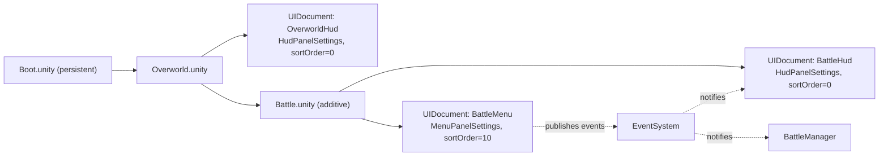

# UI Toolkit — Overview & Project Wiring

> Doc 1 of 3. Companions: [UI_TOOLKIT_USS.md](UI_TOOLKIT_USS.md) · [UI_TOOLKIT_COMPONENTS.md](UI_TOOLKIT_COMPONENTS.md).

This document is the entry point for building runtime UI in Pawchinko with Unity's UI Toolkit. It covers concepts, project layout, the `UIDocument` + `UIView` + `UIManager` pattern we use, scene wiring, and the most common ways AI agents misuse the API. All code is inline and runnable as-is; nothing depends on an external sample project.

---

## How to read this file

- First pass: §2 -> §3 -> §6 -> §11 (starter recipe).
- Reference: §13 ("hallucination guard") whenever an agent is about to write UI Toolkit code, and §14 (cheat sheet) for the 30 most-used types.
- If you're about to write `using UnityEngine.UI;` for runtime gameplay UI — **stop**. That's uGUI, the legacy system. UI Toolkit lives in `UnityEngine.UIElements`. See §13.

---

## 1. Conventions used in this doc

- C# style: Allman braces, `Pawchinko` / `Pawchinko.UI` namespace, `_camelCase` for private runtime fields, `camelCase` for `[SerializeField]` Inspector fields, `[Header(...)]` groups, `[ClassName]` log prefix. Per `Docs~/Desgin/AI_AGENT_CODE_GUIDE.md` §5–§7.
- UI -> game communication: Pawchinko's `EventSystem.Publish/Subscribe/Unsubscribe`, never direct manager-to-manager calls. Per `Docs~/Desgin/AI_AGENT_CODE_GUIDE.md` §9.
- Folder paths in code samples assume `Assets/UI/...` (see §3).

---

## 2. UI Toolkit in one page

Three languages, three jobs:

| Layer | Language | Job |
|---|---|---|
| Structure | UXML | Element hierarchy. Like HTML. |
| Style | USS | Look + layout. Like CSS, but not 1:1 (see USS doc §3). |
| Behavior | C# | Wire events, mutate elements, drive game logic. |

UI Toolkit is **retained mode**: the visual tree lives in memory; you mutate elements, the renderer redraws. There is no `Update()` per element; you push changes when state changes.

Layout is **flexbox-first**: `flex-direction`, `justify-content`, `align-items`, `flex-grow`. There is **no CSS Grid**.

UI Toolkit serves both runtime game UI and Editor UI from the same primitives. This doc focuses entirely on **runtime**.

### uGUI -> UI Toolkit cheat sheet

| Concept | uGUI (legacy) | UI Toolkit (use this) |
|---|---|---|
| Root container | `Canvas` | `UIDocument` + `PanelSettings` |
| Element | `GameObject` + components (`Image`, `Text`...) | `VisualElement` (no GameObject) |
| Layout | `RectTransform` + `LayoutGroup` | Flexbox via USS |
| Style source | Per-component fields | USS file |
| Reuse | Prefab | UXML `<ui:Template>` + custom `[UxmlElement]` |
| Mutation | `GetComponent<Image>().color = ...` | `element.style.backgroundColor = ...` or class toggle |
| Click | `Button.onClick.AddListener` | `RegisterCallback<ClickEvent>` |
| Text | `Text` / `TextMeshProUGUI` | `Label` (TextMeshPro SDF supported) |
| Slider | `Slider` (uGUI) | `Slider` (`UnityEngine.UIElements.Slider`) |
| Toggle | `Toggle` (uGUI) | `Toggle` or custom `BaseField<bool>` |

If you find yourself reaching for `Canvas`, `RectTransform`, or `using UnityEngine.UI;` — you're in the wrong system.

### What's in `UnityEngine.UIElements`

- Containers: `VisualElement`, `ScrollView`, `GroupBox`, `Foldout`.
- Controls: `Label`, `Button`, `Toggle`, `Slider`, `SliderInt`, `MinMaxSlider`, `TextField`, `IntegerField`, `FloatField`, `DropdownField`, `RadioButton`, `RadioButtonGroup`, `ProgressBar`.
- Lists: `ListView`, `MultiColumnListView`, `TreeView`.
- Events: `ClickEvent`, `PointerDownEvent`, `PointerMoveEvent`, `PointerUpEvent`, `PointerEnterEvent`, `PointerLeaveEvent`, `KeyDownEvent`, `NavigationSubmitEvent`, `ChangeEvent<T>`, `GeometryChangedEvent`, `CustomStyleResolvedEvent`, `AttachToPanelEvent`, `DetachFromPanelEvent`.
- Asset types: `VisualTreeAsset` (loaded from a `.uxml`), `StyleSheet` (loaded from a `.uss`), `PanelSettings` (asset).

---

## 3. Project setup checklist

### Packages

`com.unity.ui` is **built into Unity 6.x**. Do **not** "add the UI Toolkit package" — there is nothing to add. If a tutorial tells you to install it, the tutorial is from before Unity 2021.

### `PanelSettings` asset

Create one per UI surface (`Project > Create > UI Toolkit > Panel Settings Asset`). Recommended Pawchinko defaults:

| Field | Value | Why |
|---|---|---|
| `Theme Style Sheet` | unset | We manage stylesheets manually for clarity (no `.tss`). |
| `Scale Mode` | `Scale With Screen Size` | Mobile-first responsiveness. |
| `Reference Resolution` | `1920 x 1080` (landscape) or `1080 x 1920` (portrait) | Match the game's design intent. |
| `Match` | `0.5` | Split between width-fit and height-fit. |
| `Sort Order` | `0` for HUD, `10` for modal overlays, `20` for system popups | Higher sort order draws on top. |
| `Target Texture` | unset | Set only if rendering UI to a render texture (e.g. world-space UI). |

Two presets in `Assets/UI/PanelSettings/`:

- `HudPanelSettings.asset` — sort order `0`. Mounted on always-on HUD documents.
- `MenuPanelSettings.asset` — sort order `10`. Mounted on modal/menu documents.

### Folder layout

`UI/` is a **top-level folder under `Assets/`**, sibling to `Scripts/`, `VisualAssets/`, `Scenes/`. UI is its own concern — UXML/USS/PanelSettings/UI sprites/UI fonts are tightly coupled and only consumed by the UI layer.

```
Assets/
├── Scripts/        (UI-related C# under Scripts/UI/, per code guide §4)
├── VisualAssets/   (game art only — models, materials, VFX, environment textures)
├── Scenes/
├── UI/             <-- this doc's home
│   ├── PanelSettings/
│   │   ├── HudPanelSettings.asset
│   │   └── MenuPanelSettings.asset
│   ├── Uxml/
│   │   ├── Hud.uxml             (master document for in-battle HUD)
│   │   ├── PauseMenu.uxml
│   │   ├── MainMenu.uxml
│   │   └── Components/          (small reusable templates)
│   │       ├── HealthBar.uxml
│   │       └── SlotButton.uxml
│   ├── Uss/
│   │   ├── Base/                Tokens.uss, Colors.uss, Text.uss, Buttons.uss, Common.uss
│   │   ├── Screens/             Hud.uss, PauseMenu.uss, MainMenu.uss
│   │   └── Components/          HealthBar.uss, SlideToggle.uss, RadialProgress.uss
│   ├── Sprites/                 UI sprites — 9-slice panels, button atlases, icons
│   └── Fonts/                   .ttf source + generated *_SDF.asset (UI fonts only)
└── ...
```

> **Note for the code guide**: this layout extends the top-level folder rules in `Docs~/Desgin/AI_AGENT_CODE_GUIDE.md` §2. When `UI/` is first added, update the code guide in the same change to register it as an allowed top-level folder. Per code guide §1, *"if a rule here conflicts with what the project actually needs, update this doc in the same change."*

UI-related C# (managers, views, custom controls) still lives under `Scripts/UI/` per the code guide, **not** under `Assets/UI/`. The split is: `Scripts/UI/` for code, `Assets/UI/` for assets.

---

## 4. UXML — full anatomy

### Root tag

```xml
<ui:UXML xmlns:ui="UnityEngine.UIElements" editor-extension-mode="False">
    <!-- contents -->
</ui:UXML>
```

`editor-extension-mode="False"` is the runtime setting. The `xmlns:uie="UnityEditor.UIElements"` namespace is only needed for editor windows — leave it off in runtime UXML.

### Common elements

```xml
<ui:VisualElement name="root" class="screen" />
<ui:Label text="Hello" name="title" class="text--lg" />
<ui:Button text="Play" name="play-button" class="button--primary" />
<ui:Toggle label="Sound" name="sound-toggle" />
<ui:Slider low-value="0" high-value="1" value="0.5" name="music-slider" />
<ui:DropdownField label="Difficulty" name="difficulty" />
<ui:TextField label="Name" name="player-name" />
<ui:ScrollView name="log-scroll" />
<ui:ListView name="inventory-list" />
<ui:RadioButtonGroup name="frame-rate" />
<ui:ProgressBar name="loading-bar" value="0.5" low-value="0" high-value="1" />
```

### Common attributes

- `name` — used by `Q<T>("name")` to find elements from C#. Case-sensitive.
- `class` — space-separated list of USS classes: `class="button--primary text--lg"`.
- `style` — inline style; **discouraged** for reusable look (use a USS class).
- `text` — for `Label`, `Button`, etc. Localized strings should be set from C#.
- `picking-mode` — `Position` (default, receives input) or `Ignore` (passes input through). Use `Ignore` on decorative containers.
- `tabindex` — keyboard/gamepad navigation order.
- `tooltip` — string shown on hover.
- `enable-rich-text` — on `Label` and `Button`, enables `<b>`, `<i>`, `<color>` etc.

### Templates

Reuse a UXML inside another UXML:

```xml
<ui:UXML xmlns:ui="UnityEngine.UIElements" editor-extension-mode="False">
    <ui:Template name="HealthBar" src="project://database/Assets/UI/Uxml/Components/HealthBar.uxml" />
    <ui:VisualElement name="hud-row" style="flex-direction: row;">
        <ui:Instance template="HealthBar" name="PlayerHealth" />
        <ui:Instance template="HealthBar" name="EnemyHealth" />
    </ui:VisualElement>
</ui:UXML>
```

`<ui:Instance>` materializes the template at edit time; the resulting element is a normal `VisualElement` you query by its `name` attribute on the instance.

### Stylesheets

Attach via `<Style>` at the top of a UXML (order matters — last sheet wins on equal specificity):

```xml
<ui:UXML xmlns:ui="UnityEngine.UIElements" editor-extension-mode="False">
    <Style src="project://database/Assets/UI/Uss/Base/Tokens.uss" />
    <Style src="project://database/Assets/UI/Uss/Base/Common.uss" />
    <Style src="project://database/Assets/UI/Uss/Screens/PauseMenu.uss" />
    <ui:VisualElement name="pause" class="pause-menu">
        <!-- ... -->
    </ui:VisualElement>
</ui:UXML>
```

You can also attach stylesheets at runtime: `element.styleSheets.Add(stylesheetAsset);` — useful for theme swaps.

### Custom elements

Custom controls authored with `[UxmlElement]` (see Components doc) appear in UXML by their full namespace:

```xml
<ui:UXML xmlns:ui="UnityEngine.UIElements" xmlns:pw="Pawchinko.UI">
    <pw:HealthBarComponent name="PlayerHealth" HealthBarTitle="HERO" />
</ui:UXML>
```

The `xmlns:pw="Pawchinko.UI"` alias keeps the markup short.

### Full single-screen example (HomeScreen)

A complete, paste-able UXML for a home screen with a title, level card, and play button:

```xml
<ui:UXML xmlns:ui="UnityEngine.UIElements" editor-extension-mode="False">
    <Style src="project://database/Assets/UI/Uss/Base/Tokens.uss" />
    <Style src="project://database/Assets/UI/Uss/Base/Common.uss" />
    <Style src="project://database/Assets/UI/Uss/Base/Buttons.uss" />
    <Style src="project://database/Assets/UI/Uss/Screens/HomeScreen.uss" />
    <ui:VisualElement name="home__screen" class="home-screen" style="width: 100%; height: 100%;">
        <ui:VisualElement name="home__background" picking-mode="Ignore" class="home-screen__background" />
        <ui:VisualElement name="home__title" picking-mode="Ignore" class="title__container">
            <ui:Label name="home__title-label" text="PAWCHINKO" class="text__size--large text__shadow--large" />
            <ui:Label name="home__subtitle" text="A pachinko adventure" class="text__size--md text--muted" />
        </ui:VisualElement>
        <ui:VisualElement name="home__play-card" class="play-card">
            <ui:Label name="home__level-name" text="Level 0" class="play-card__level-name" />
            <ui:Button name="home__play-button" text="PLAY" class="button--primary play-card__button" />
        </ui:VisualElement>
    </ui:VisualElement>
</ui:UXML>
```

### Full master-UXML composition example

One UXML that composes several screens via templates, with a safe-area wrapper and decorative overlay:

```xml
<ui:UXML xmlns:ui="UnityEngine.UIElements" editor-extension-mode="False">
    <ui:Template name="HudScreen"   src="project://database/Assets/UI/Uxml/HudScreen.uxml" />
    <ui:Template name="PauseScreen" src="project://database/Assets/UI/Uxml/PauseScreen.uxml" />
    <ui:Template name="WinScreen"   src="project://database/Assets/UI/Uxml/WinScreen.uxml" />
    <ui:Template name="LoseScreen"  src="project://database/Assets/UI/Uxml/LoseScreen.uxml" />
    <Style src="project://database/Assets/UI/Uss/Base/Tokens.uss" />
    <Style src="project://database/Assets/UI/Uss/Base/Common.uss" />
    <ui:VisualElement name="background-graphic" picking-mode="Ignore" class="background-graphic" />
    <ui:VisualElement name="safe-area" picking-mode="Ignore" style="position: absolute; width: 100%; height: 100%;">
        <ui:Instance template="HudScreen"   name="HudScreen"   picking-mode="Ignore" style="width: 100%; height: 100%;" />
        <ui:Instance template="PauseScreen" name="PauseScreen" picking-mode="Ignore" style="position: absolute; width: 100%; height: 100%; display: none;" />
        <ui:Instance template="WinScreen"   name="WinScreen"   picking-mode="Ignore" style="position: absolute; width: 100%; height: 100%; display: none;" />
        <ui:Instance template="LoseScreen"  name="LoseScreen"  picking-mode="Ignore" style="position: absolute; width: 100%; height: 100%; display: none;" />
    </ui:VisualElement>
    <ui:VisualElement name="overlay-vfx" picking-mode="Ignore" class="overlay-vfx" />
</ui:UXML>
```

`picking-mode="Ignore"` on every layout container that shouldn't intercept clicks. Each `<ui:Instance>` has `display: none;` until shown by C#.

---

## 5. C# — `UIView` base class

A `UIView` wraps one logical screen or panel — usually one `<ui:Instance>` from the master UXML. It owns the references to its visual elements and the callbacks for interactions. Keep one `UIView` subclass per screen.

```csharp
using System;
using UnityEngine.UIElements;

namespace Pawchinko.UI
{
    /// <summary>
    /// Base class for one logical screen, panel, or sub-region of a UIDocument.
    /// One UIView subclass per <ui:Instance> in the master UXML.
    /// </summary>
    public abstract class UIView : IDisposable
    {
        protected readonly VisualElement root;
        protected bool hideOnAwake = true;

        public bool IsHidden => root.style.display == DisplayStyle.None;
        public VisualElement Root => root;

        protected UIView(VisualElement root)
        {
            this.root = root ?? throw new ArgumentNullException(nameof(root));
            if (hideOnAwake) Hide();
            SetVisualElements();
            RegisterButtonCallbacks();
        }

        protected virtual void SetVisualElements() { }
        protected virtual void RegisterButtonCallbacks() { }

        public virtual void Show() { root.style.display = DisplayStyle.Flex; }
        public virtual void Hide() { root.style.display = DisplayStyle.None; }
        public virtual void Dispose() { }
    }
}
```

Subclasses override `SetVisualElements` to query elements (`root.Q<Button>("foo")`), `RegisterButtonCallbacks` to wire events, and `Dispose` to unregister callbacks.

---

## 6. C# — `UIManager` (Pawchinko manager pattern)

`UIManager` owns the scene's `UIDocument` and constructs each `UIView`. It follows the standard Pawchinko manager skeleton (`Initialize(EventSystem)` per code guide §7) and routes UI <-> game communication through `EventSystem` (code guide §9).

```csharp
using UnityEngine;
using UnityEngine.UIElements;

namespace Pawchinko.UI
{
    /// <summary>
    /// Owns the scene's UIDocument and its UIViews. Subscribes to gameplay events to
    /// show/hide screens. One UIManager per scene that has UI.
    /// </summary>
    [RequireComponent(typeof(UIDocument))]
    public class UIManager : MonoBehaviour
    {
        [Header("References")]
        [SerializeField] private EventSystem eventSystem;

        private UIDocument _document;
        private HudView _hud;
        private PauseView _pause;
        private WinView _win;
        private LoseView _lose;

        public void Initialize(EventSystem eventSystem)
        {
            this.eventSystem = eventSystem;
            _document = GetComponent<UIDocument>();

            VisualElement root = _document.rootVisualElement;
            _hud   = new HudView(root.Q<VisualElement>("HudScreen"));
            _pause = new PauseView(root.Q<VisualElement>("PauseScreen"));
            _win   = new WinView(root.Q<VisualElement>("WinScreen"));
            _lose  = new LoseView(root.Q<VisualElement>("LoseScreen"));

            _hud.Show();

            this.eventSystem.Subscribe<BattlePausedEvent>(OnBattlePaused);
            this.eventSystem.Subscribe<BattleResumedEvent>(OnBattleResumed);
            this.eventSystem.Subscribe<BattleEndedEvent>(OnBattleEnded);

            Debug.Log("[UIManager] Initialized");
        }

        private void OnBattlePaused(BattlePausedEvent _)
        {
            _pause.Show();
        }

        private void OnBattleResumed(BattleResumedEvent _)
        {
            _pause.Hide();
        }

        private void OnBattleEnded(BattleEndedEvent evt)
        {
            if (evt.PlayerWon) _win.Show();
            else _lose.Show();
        }

        private void OnDestroy()
        {
            if (eventSystem != null)
            {
                eventSystem.Unsubscribe<BattlePausedEvent>(OnBattlePaused);
                eventSystem.Unsubscribe<BattleResumedEvent>(OnBattleResumed);
                eventSystem.Unsubscribe<BattleEndedEvent>(OnBattleEnded);
            }
            _hud?.Dispose();
            _pause?.Dispose();
            _win?.Dispose();
            _lose?.Dispose();
        }
    }
}
```

`UIManager` is registered with `GameManager` like any other manager (see code guide §7). For the `Battle` scene, `BattleManager` owns the `UIManager` reference and forwards `Initialize`.

---

## 7. C# — concrete view example (`PauseView`)

Full pattern: query elements, register callbacks, publish events, dispose cleanly.

```csharp
using UnityEngine;
using UnityEngine.UIElements;

namespace Pawchinko.UI
{
    /// <summary>
    /// In-battle pause overlay. Resume / quit buttons + music volume slider.
    /// </summary>
    public class PauseView : UIView
    {
        private Button _resumeButton;
        private Button _quitButton;
        private Slider _musicSlider;
        private Slider _sfxSlider;

        public PauseView(VisualElement root) : base(root) { }

        protected override void SetVisualElements()
        {
            _resumeButton = root.Q<Button>("pause__resume-button");
            _quitButton   = root.Q<Button>("pause__quit-button");
            _musicSlider  = root.Q<Slider>("pause__music-slider");
            _sfxSlider    = root.Q<Slider>("pause__sfx-slider");

            if (_resumeButton == null) Debug.LogError("[PauseView] pause__resume-button not found in UXML");
            if (_quitButton   == null) Debug.LogError("[PauseView] pause__quit-button not found in UXML");
        }

        protected override void RegisterButtonCallbacks()
        {
            _resumeButton.RegisterCallback<ClickEvent>(OnResume);
            _quitButton.RegisterCallback<ClickEvent>(OnQuit);
            _musicSlider.RegisterValueChangedCallback(OnMusicChanged);
            _sfxSlider.RegisterValueChangedCallback(OnSfxChanged);
        }

        private void OnResume(ClickEvent _)
        {
            GameManager.Instance.EventSystem.Publish(new BattleResumedEvent());
        }

        private void OnQuit(ClickEvent _)
        {
            GameManager.Instance.EventSystem.Publish(new BattleQuitRequestedEvent());
        }

        private void OnMusicChanged(ChangeEvent<float> evt)
        {
            GameManager.Instance.EventSystem.Publish(new MusicVolumeChangedEvent(evt.newValue));
        }

        private void OnSfxChanged(ChangeEvent<float> evt)
        {
            GameManager.Instance.EventSystem.Publish(new SfxVolumeChangedEvent(evt.newValue));
        }

        public override void Dispose()
        {
            _resumeButton.UnregisterCallback<ClickEvent>(OnResume);
            _quitButton.UnregisterCallback<ClickEvent>(OnQuit);
            _musicSlider.UnregisterValueChangedCallback(OnMusicChanged);
            _sfxSlider.UnregisterValueChangedCallback(OnSfxChanged);
        }
    }
}
```

The PauseView **never** calls a manager directly. Every interaction publishes an event; managers subscribe and react. Per code guide §9.

---

## 8. Querying elements

### Methods

```csharp
// By name
Button play = root.Q<Button>("home__play-button");

// By class
VisualElement bar = root.Q<VisualElement>(className: "health-bar");

// By name AND class
Label score = root.Q<Label>("score", "text--lg");

// All elements of a type
root.Query<Button>().ForEach(b => b.AddToClassList("button--primary"));

// All elements with a class
root.Query<VisualElement>(className: "health-bar").ForEach(bar => bar.MarkDirtyRepaint());
```

### Rules

- **Names are case-sensitive.** `"PlayButton"` and `"playbutton"` are different.
- **`Q` returns `null` silently** if not found. Always log + null-check during development.
- **Don't `Q` from `Awake()`.** `UIDocument.rootVisualElement` is not guaranteed to be ready. Use `OnEnable` (MonoBehaviour) or `Initialize(EventSystem)` (Pawchinko manager).
- **Query from the deepest known root.** Pass each `UIView` only its own subtree (the `<ui:Instance>` element); don't query the entire panel.

### Pitfalls

```csharp
// WRONG — element is inside a hidden <ui:Instance> that wasn't materialized
var button = document.rootVisualElement.Q<Button>("nested-button"); // returns null

// RIGHT — the <ui:Instance> exists; templates materialize at load time
// the issue is usually that you've typo'd the name, or the element is in a different document
```

---

## 9. Show/hide patterns

| Goal | Technique | Notes |
|---|---|---|
| Remove from layout entirely | `style.display = DisplayStyle.None;` | Cheapest. What `UIView.Hide` does. Element takes no space. |
| Hide but keep layout space | `style.visibility = Visibility.Hidden;` | Element stays where it was, invisible. |
| Animate (fade, slide) | Toggle a USS class with `transition-*` | See USS doc §8. Class swaps drive the transition. |
| Disable interaction only | `element.SetEnabled(false);` | Greys out; blocks input. |
| Pass clicks through | `element.pickingMode = PickingMode.Ignore;` | Decorative containers. Set in UXML via `picking-mode="Ignore"`. |

```csharp
// Class-driven fade (preferred for animated hide):
panel.AddToClassList("panel--hidden");
panel.RemoveFromClassList("panel--visible");

// Hard hide (used in UIView.Hide):
panel.style.display = DisplayStyle.None;
```

---

## 10. Scene wiring for Pawchinko

Pawchinko uses three scenes (`Boot`, `Overworld`, `Battle`) per `Docs~/Desgin/AI_AGENT_CODE_GUIDE.md` §8. UI Toolkit fits as follows:

- **Boot.unity** — no `UIDocument`. Only `GameManager`, `EventSystem`, `SceneFlowManager`.
- **Overworld.unity** — one `UIDocument` for the persistent overworld HUD (currency, minimap, settings cog). `UIManager` is owned by `OverworldManager` and `Initialize`d when the scene loads.
- **Battle.unity** — typically two `UIDocument`s:
  - HUD document (sort order `0`, mounted on `HudPanelSettings`) — health bars, score, ball queue.
  - Menu document (sort order `10`, mounted on `MenuPanelSettings`) — pause/win/lose overlays.

`BattleManager` owns the battle `UIManager`(s) and `Initialize`s them on scene load.



Why two documents? Sort order is per-document. Keeping the HUD (always-on) and the menu (modal, blurs/darkens HUD) separate lets you transition them independently without restacking elements.

---

## 11. End-to-end starter recipe

Build a working pause menu from zero in eleven steps.

1. **Create `PanelSettings`**: `Project > Create > UI Toolkit > Panel Settings Asset`, name it `MenuPanelSettings.asset`, place under `Assets/UI/PanelSettings/`. Set Sort Order to `10`.
2. **Create the master UXML**: `Project > Create > UI Toolkit > UI Document`, name it `BattleMenu.uxml`, place under `Assets/UI/Uxml/`. Open in UI Builder.
3. **Build the layout** in UI Builder or paste this:
   ```xml
   <ui:UXML xmlns:ui="UnityEngine.UIElements" editor-extension-mode="False">
       <Style src="project://database/Assets/UI/Uss/Base/Tokens.uss" />
       <Style src="project://database/Assets/UI/Uss/Base/Buttons.uss" />
       <Style src="project://database/Assets/UI/Uss/Screens/PauseMenu.uss" />
       <ui:VisualElement name="PauseScreen" class="pause-menu" style="display: none;">
           <ui:VisualElement class="pause-menu__panel">
               <ui:Label text="Paused" class="text__size--large pause-menu__title" />
               <ui:Slider name="pause__music-slider" label="Music" low-value="0" high-value="1" value="0.5" />
               <ui:Slider name="pause__sfx-slider"   label="SFX"   low-value="0" high-value="1" value="0.5" />
               <ui:Button name="pause__resume-button" text="Resume" class="button--primary" />
               <ui:Button name="pause__quit-button"   text="Quit"   class="button--secondary" />
           </ui:VisualElement>
       </ui:VisualElement>
   </ui:UXML>
   ```
4. **Create the USS** at `Assets/UI/Uss/Screens/PauseMenu.uss`:
   ```css
   .pause-menu {
       position: absolute;
       width: 100%;
       height: 100%;
       align-items: center;
       justify-content: center;
       background-color: rgba(0, 0, 0, 0.6);
   }
   .pause-menu__panel {
       width: 480px;
       padding: var(--space-4);
       background-color: var(--color-surface);
       border-radius: var(--radius-lg);
       align-items: stretch;
   }
   .pause-menu__title {
       -unity-text-align: middle-center;
       margin-bottom: var(--space-3);
   }
   ```
5. **In the scene**, create a GameObject `BattleMenu`, add `UIDocument` component, drag `BattleMenu.uxml` into Source Asset, drag `MenuPanelSettings.asset` into Panel Settings.
6. **Add `UIManager.cs` to the same GameObject** (paste from §6 above, simplify to only construct `PauseView`).
7. **Create `PauseView.cs`** under `Scripts/UI/UIViews/` (paste from §7 above).
8. **Define events** in `Scripts/Core/Events.cs` per code guide §9: `BattlePausedEvent`, `BattleResumedEvent`, `BattleQuitRequestedEvent`, `MusicVolumeChangedEvent`, `SfxVolumeChangedEvent`.
9. **Wire `Initialize`** from `BattleManager`:
   ```csharp
   if (uiManager != null) uiManager.Initialize(eventSystem);
   else Debug.LogError("[BattleManager] UIManager not assigned in Inspector!");
   ```
10. **Trigger pause** from anywhere: `GameManager.Instance.EventSystem.Publish(new BattlePausedEvent());`
11. **Press Play**. Open UI Debugger (`Window > UI Toolkit > Debugger`) if anything misbehaves.

---

## 12. Editor workflow tips

### UI Builder

`Window > UI Toolkit > UI Builder`. Right-click any `.uxml` in the Project view -> "Open in UI Builder."

- **Hierarchy** pane (left): the visual tree. Drag elements from the **Library** here.
- **Viewport** (center): live preview. Drag-resize panels.
- **Inspector** (right): selected element's name, classes, style, attributes.
- **StyleSheets** pane (bottom-left): manage the attached USS files.

You can author USS visually (Inspector style fields) or edit the `.uss` file directly — both write to the same file.

### UI Debugger

`Window > UI Toolkit > Debugger`. Lets you inspect the **live runtime** visual tree at Play time.

- Pick a panel from the dropdown.
- Click any element in the scene to inspect it.
- See computed styles, applied classes, layout rect.
- **Use this whenever a `Q<>` returns null** — it shows you the exact name and classes the element has at runtime.

### Live Reload

In Game view there's a "UI Toolkit Live Reload" toggle (and a "UXML Live Reload" toggle). Enabled, edits to `.uxml` and `.uss` apply without re-entering Play mode.

---

## 13. Hallucination guard — what AI agents commonly get wrong

Read this before writing any UI Toolkit code.

| Don't | Do | Why |
|---|---|---|
| `using UnityEngine.UI;` for runtime gameplay UI | `using UnityEngine.UIElements;` | uGUI vs UI Toolkit. Different worlds. |
| `GetComponent<Button>()` on a `VisualElement` | `root.Q<Button>("name")` | `VisualElement` is plain C#, not a `Component`. |
| `RectTransform`, `Canvas` | `UIDocument` + `PanelSettings` + flexbox USS | Different layout system entirely. |
| `Q<>` from `Awake()` | `Q<>` from `OnEnable` or `Initialize(EventSystem)` | `rootVisualElement` may not be ready in `Awake`. |
| `<Style>` inside a `<ui:VisualElement>` | `<Style>` at the top of the UXML | Stylesheets attach to the document, not to elements. |
| `class="foo, bar"` or `class="foo,bar"` | `class="foo bar"` | Space-separated, like CSS. |
| Forget `picking-mode="Ignore"` on decorative containers | Set it on every layout-only element | Otherwise they intercept clicks. |
| `[UxmlFactory]` / `UxmlTraits` | `[UxmlElement]` + `[UxmlAttribute]` | The factory/traits API is deprecated in Unity 6. |
| `new GameObject()` for a UI element | `new VisualElement()` | UI Toolkit elements have no GameObject. |
| `DisplayStyle.Flex` as a string | `DisplayStyle.Flex` as the enum | `style.display = DisplayStyle.Flex;`, not `"flex"`. |
| `style.X = value` for everything | Toggle a USS class | Inline style overrides USS until cleared with `StyleKeyword.Null`. |
| Animate `display` | Animate `opacity` / `scale` / `translate` | `display` is discrete, not continuous. |
| `transform: translateX(10px)` in USS | `translate: 10px 0;` | UI Toolkit uses direct USS properties, not the CSS `transform` shorthand. |
| `Image` for backgrounds | `VisualElement` with `style.backgroundImage` | `UIElements.Image` exists but is rarely needed. |
| `Button.onClick.AddListener` | `button.RegisterCallback<ClickEvent>(handler)` | uGUI vs UI Toolkit event API. |
| Static event classes like `MainMenuUIEvents.Foo += ...` | `eventSystem.Subscribe<FooEvent>(handler)` | Pawchinko uses its own `EventSystem` (code guide §9). |
| Add the UI Toolkit package in Package Manager | Don't — it's built in | `com.unity.ui` is part of Unity 6 by default. |
| Use `@media` or `@import` in USS | Swap stylesheets at runtime; use `<Style>` tags | USS doesn't support those rules. |
| Nest selectors with `.foo .bar:not(:hover)` | Use explicit BEM classes | USS doesn't support `:not()`/`:has()`/`:nth-child`. |

If a sample tells you to do something on the left column, distrust the sample.

---

## 14. Cheat sheet — 30 most-used types/methods

### Types

```csharp
UnityEngine.UIElements.UIDocument         // MonoBehaviour with rootVisualElement
UnityEngine.UIElements.PanelSettings       // ScriptableObject; controls scaling/sort order
UnityEngine.UIElements.VisualElement       // base UI node
UnityEngine.UIElements.Label               // text
UnityEngine.UIElements.Button              // clickable button
UnityEngine.UIElements.Toggle              // checkbox
UnityEngine.UIElements.Slider              // float slider
UnityEngine.UIElements.SliderInt           // int slider
UnityEngine.UIElements.TextField           // editable text
UnityEngine.UIElements.DropdownField       // dropdown
UnityEngine.UIElements.RadioButtonGroup    // grouped radios
UnityEngine.UIElements.ScrollView          // scrollable container
UnityEngine.UIElements.ListView            // virtualized list
UnityEngine.UIElements.ProgressBar         // built-in progress bar
UnityEngine.UIElements.VisualTreeAsset     // the .uxml asset type
UnityEngine.UIElements.StyleSheet          // the .uss asset type
```

### Members on `VisualElement`

```csharp
element.Q<T>("name")
element.Query<T>(className: "css-class").ForEach(...)
element.Add(child)
element.RemoveFromHierarchy()
element.AddToClassList("css-class")
element.RemoveFromClassList("css-class")
element.EnableInClassList("css-class", boolValue)
element.RegisterCallback<ClickEvent>(handler)
element.UnregisterCallback<ClickEvent>(handler)
element.style.display = DisplayStyle.Flex / DisplayStyle.None
element.style.opacity = 0.5f
element.style.backgroundImage = new StyleBackground(sprite)
element.SetEnabled(false)
element.MarkDirtyRepaint()           // for elements with generateVisualContent
element.schedule.Execute(() => ...).StartingIn(100)
element.schedule.Execute(() => ...).Every(50)
```

---

## 15. Further reading

- Unity 6 Manual: [UI Toolkit](https://docs.unity3d.com/6000.4/Documentation/Manual/UIElements.html)
- Unity 6 Manual: [Introduction to UI Toolkit](https://docs.unity3d.com/6000.4/Documentation/Manual/ui-systems/introduction-ui-toolkit.html)
- Unity 6 Manual: [Get started with UI Toolkit](https://docs.unity3d.com/6000.4/Documentation/Manual/UIE-simple-ui-toolkit-workflow.html)
- Companion: [UI_TOOLKIT_USS.md](UI_TOOLKIT_USS.md) — styling, transitions, animations.
- Companion: [UI_TOOLKIT_COMPONENTS.md](UI_TOOLKIT_COMPONENTS.md) — custom controls, manipulators, data binding.
- Pawchinko code guide: `Docs~/Desgin/AI_AGENT_CODE_GUIDE.md` — manager pattern, EventSystem, folder rules.
